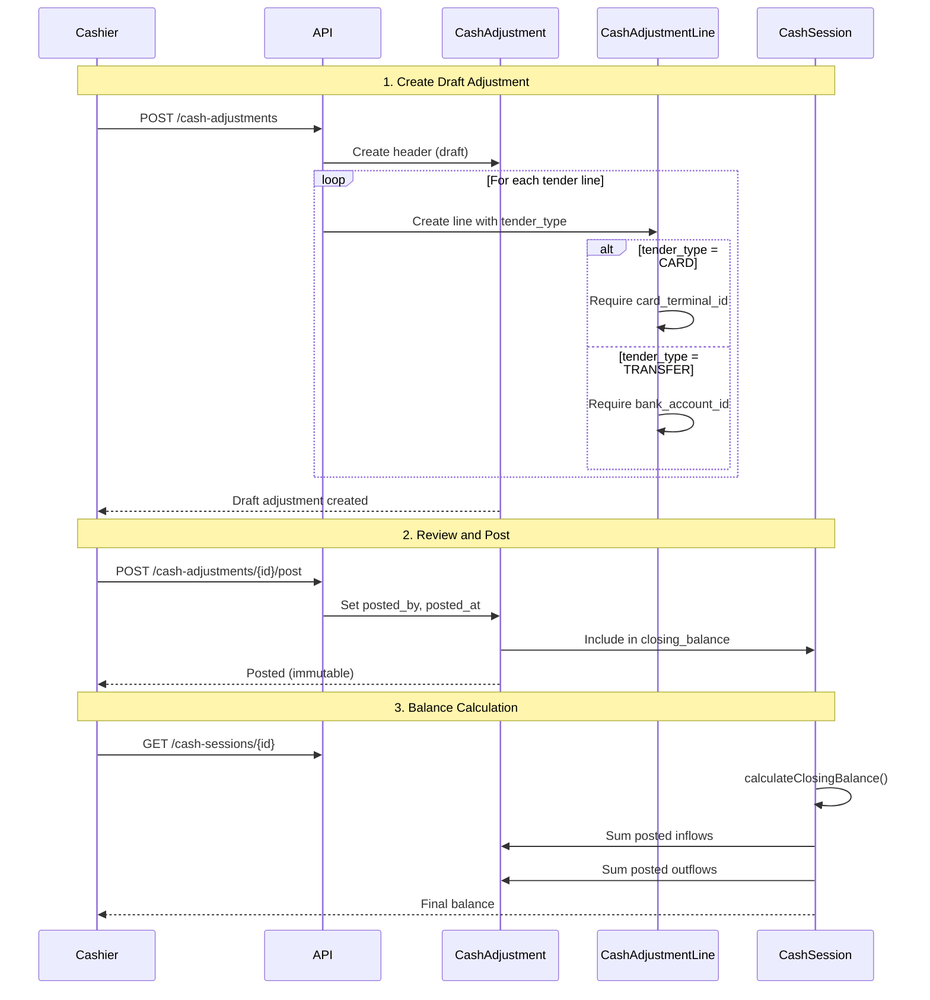

## Overview

**Cash adjustments** capture income or outflow transactions broken down by tender type (cash, card, transfer). Each adjustment contains a header with metadata and one or more lines representing individual tender amounts.

## Adjustment Types

From [CashAdjustment.php:30-33](~/workspace/source/code/api/app/Models/CashAdjustment.php:30-33):

```php
public const TYPE_EXTERNAL_IMPORT = 'EXTERNAL_IMPORT';
public const TYPE_CORRECTION = 'CORRECTION';
```

| Type | Purpose | When to Use |
|------|---------|-------------|
| `EXTERNAL_IMPORT` | Daily sales totals from external POS | End-of-day import from another system |
| `CORRECTION` | Manual adjustments to fix variances | Physical count doesn't match expected balance |

## Direction

From [CashAdjustment.php:35-38](~/workspace/source/code/api/app/Models/CashAdjustment.php:35-38):

```php
public const DIRECTION_INFLOW = 'INFLOW';
public const DIRECTION_OUTFLOW = 'OUTFLOW';
```

| Direction | Description | Effect on Balance |
|-----------|-------------|-------------------|
| `INFLOW` | Income or deposits | Increases closing balance |
| `OUTFLOW` | Withdrawals or transfers out | Decreases closing balance |

<Note>
Most adjustments are `INFLOW` (daily sales). Use `OUTFLOW` for vault transfers or withdrawals.
</Note>

## Adjustment Structure

### Header Fields

| Field | Type | Description |
|-------|------|-------------|
| `cash_session_id` | Foreign Key | Links to the daily session |
| `source_system` | String | External system name (e.g., "ExternalPOS") |
| `type` | Enum | `EXTERNAL_IMPORT` or `CORRECTION` |
| `direction` | Enum | `INFLOW` or `OUTFLOW` |
| `notes` | Text | Additional context or reason |
| `posted_by` | Foreign Key | User who approved (nullable until posted) |
| `posted_at` | Timestamp | When finalized (nullable until posted) |
| `meta` | JSON | Extra metadata (batch ID, external reference) |

### Line Fields

From [CashAdjustmentLine.php:15-24](~/workspace/source/code/api/app/Models/CashAdjustmentLine.php:15-24):

| Field | Type | Required | Description |
|-------|------|----------|-------------|
| `cash_adjustment_id` | Foreign Key | Yes | Links to adjustment header |
| `tender_type` | Enum | Yes | `CASH`, `CARD`, or `TRANSFER` |
| `amount` | Decimal | Yes | Transaction amount (4 decimal places) |
| `currency` | String | Yes | Currency code (default: `MXN`) |
| `card_terminal_id` | Foreign Key | If `CARD` | Links to terminal |
| `bank_account_id` | Foreign Key | If `TRANSFER` | Links to bank account |
| `reference` | String | No | External batch or transaction ID |
| `meta` | JSON | No | Tips, fees, or other data |

### Tender Type Constants

From [CashAdjustmentLine.php:32-37](~/workspace/source/code/api/app/Models/CashAdjustmentLine.php:32-37):

```php
public const TENDER_CASH = 'CASH';
public const TENDER_CARD = 'CARD';
public const TENDER_TRANSFER = 'TRANSFER';
```

## Create an Adjustment

### Endpoint

```bash
POST /api/v1/cash-adjustments
```

### Request Example

From [CreateCashAdjustmentController.php:38-52](~/workspace/source/code/api/app/Http/Controllers/CashAdjustments/CashAdjustments/CreateCashAdjustmentController.php:38-52):

```json
{
  "cash_session_id": 1,
  "type": "EXTERNAL_IMPORT",
  "direction": "INFLOW",
  "source_system": "ExternalPOS",
  "notes": "End-of-day import for 2026-03-06",
  "lines": [
    {
      "tender_type": "CASH",
      "amount": 1250.00,
      "currency": "MXN"
    },
    {
      "tender_type": "CARD",
      "amount": 3400.00,
      "currency": "MXN",
      "card_terminal_id": 2,
      "reference": "BATCH-2026-03-06-001"
    },
    {
      "tender_type": "TRANSFER",
      "amount": 800.00,
      "currency": "MXN",
      "bank_account_id": 1,
      "reference": "TXN-XYZ123"
    }
  ],
  "meta": {
    "external_batch_id": "BATCH-2026-03-06",
    "imported_at": "2026-03-06T22:30:00Z"
  }
}
```

<Warning>
- When `tender_type` is `CARD`, `card_terminal_id` is **required**
- When `tender_type` is `TRANSFER`, `bank_account_id` is **required**
- When `tender_type` is `CASH`, both fields should be **null**
</Warning>

### Response

```json
{
  "message": "Adjustment created successfully",
  "data": {
    "id": 1,
    "cash_session_id": 1,
    "type": "EXTERNAL_IMPORT",
    "direction": "INFLOW",
    "source_system": "ExternalPOS",
    "posted_by": null,
    "posted_at": null,
    "lines": [
      {
        "id": 1,
        "tender_type": "CASH",
        "amount": "1250.0000",
        "currency": "MXN"
      },
      {
        "id": 2,
        "tender_type": "CARD",
        "amount": "3400.0000",
        "card_terminal_id": 2
      },
      {
        "id": 3,
        "tender_type": "TRANSFER",
        "amount": "800.0000",
        "bank_account_id": 1
      }
    ]
  }
}
```

## Post an Adjustment

Posting finalizes the adjustment, making it immutable and including it in the session's closing balance.

### Endpoint

```bash
POST /api/v1/cash-adjustments/{id}/post
```

From [PostCashAdjustmentController.php:34-51](~/workspace/source/code/api/app/Http/Controllers/CashAdjustments/CashAdjustments/PostCashAdjustmentController.php:34-51):

```javascript
// Post the adjustment
const response = await api.post(`/cash-adjustments/${adjustmentId}/post`);

// Response includes posted_by and posted_at
{
  "message": "Adjustment posted successfully",
  "data": {
    "id": 1,
    "posted_by": 5,
    "posted_at": "2026-03-06T23:00:00Z",
    "lines": [...]
  }
}
```

<Info>
Posting sets `posted_by` to the authenticated user and `posted_at` to the current timestamp.
</Info>

## Query Scopes

From [CashAdjustment.php:66-110](~/workspace/source/code/api/app/Models/CashAdjustment.php:66-110):

```php
// Filter by status
CashAdjustment::posted()->get();
CashAdjustment::draft()->get();

// Filter by type
CashAdjustment::byType('EXTERNAL_IMPORT')->get();

// Filter by direction
CashAdjustment::byDirection('INFLOW')->get();
CashAdjustment::inflow()->get();
CashAdjustment::outflow()->get();
```

## Helper Methods

### Status Check

```php
$adjustment->isPosted(); // Returns true if posted_at is not null
```

### Total Amount

From [CashAdjustment.php:123-126](~/workspace/source/code/api/app/Models/CashAdjustment.php:123-126):

```php
$adjustment->getTotalAmount(); // Sum of all line amounts
```

## Relationships

### Adjustment Header

- **cashSession**: Parent session [CashAdjustment.php:43-46](~/workspace/source/code/api/app/Models/CashAdjustment.php:43-46)
- **lines**: All tender lines [CashAdjustment.php:51-54](~/workspace/source/code/api/app/Models/CashAdjustment.php:51-54)
- **postedBy**: User who approved [CashAdjustment.php:59-62](~/workspace/source/code/api/app/Models/CashAdjustment.php:59-62)

### Adjustment Lines

- **cashAdjustment**: Parent header [CashAdjustmentLine.php:42-45](~/workspace/source/code/api/app/Models/CashAdjustmentLine.php:42-45)
- **cardTerminal**: Terminal for `CARD` lines [CashAdjustmentLine.php:50-53](~/workspace/source/code/api/app/Models/CashAdjustmentLine.php:50-53)
- **bankAccount**: Account for `TRANSFER` lines [CashAdjustmentLine.php:58-61](~/workspace/source/code/api/app/Models/CashAdjustmentLine.php:58-61)

## Workflow Diagram



## Use Cases

### Daily POS Import

Import end-of-day totals from external system:

```json
{
  "cash_session_id": 1,
  "type": "EXTERNAL_IMPORT",
  "direction": "INFLOW",
  "source_system": "ExternalPOS",
  "lines": [
    { "tender_type": "CASH", "amount": 2500.00 },
    { "tender_type": "CARD", "amount": 5400.00, "card_terminal_id": 1 }
  ]
}
```

### Variance Correction

Physical count shows $50 less than expected:

```json
{
  "cash_session_id": 1,
  "type": "CORRECTION",
  "direction": "OUTFLOW",
  "notes": "Physical count variance - $50 short",
  "lines": [
    { "tender_type": "CASH", "amount": 50.00 }
  ]
}
```

### Vault Transfer

Transfer excess cash to vault:

```json
{
  "cash_session_id": 1,
  "type": "CORRECTION",
  "direction": "OUTFLOW",
  "notes": "Vault deposit - excess cash",
  "lines": [
    { "tender_type": "CASH", "amount": 1000.00 }
  ]
}
```

## Best Practices

<AccordionGroup>
  <Accordion title="Batch Imports" icon="file-import">
    Use `source_system` and `reference` fields to track external batch IDs for reconciliation
  </Accordion>
  
  <Accordion title="Correction Notes" icon="note-sticky">
    Always provide detailed `notes` for corrections explaining the variance and resolution
  </Accordion>
  
  <Accordion title="Draft Review" icon="magnifying-glass">
    Review all lines before posting. Once posted, adjustments become immutable.
  </Accordion>
  
  <Accordion title="Terminal Assignment" icon="plug">
    Assign card lines to the correct terminal to track settlement by provider and terminal
  </Accordion>
  
  <Accordion title="Currency Consistency" icon="dollar-sign">
    Ensure all lines within an adjustment use the same currency (typically `MXN`)
  </Accordion>
</AccordionGroup>

## Multi-Tender Example

Complete end-of-day import with all tender types:

```javascript
const adjustment = await api.post('/cash-adjustments', {
  cash_session_id: sessionId,
  type: 'EXTERNAL_IMPORT',
  direction: 'INFLOW',
  source_system: 'ExternalPOS',
  notes: 'Daily close - Main Counter',
  lines: [
    // Cash tender
    {
      tender_type: 'CASH',
      amount: 1250.00,
      currency: 'MXN',
      meta: { counted_by: 'Cashier A' }
    },
    // Card via Terminal A
    {
      tender_type: 'CARD',
      amount: 3400.00,
      currency: 'MXN',
      card_terminal_id: 1,
      reference: 'BATCH-001',
      meta: { tips_included: 340.00 }
    },
    // Card via Terminal B
    {
      tender_type: 'CARD',
      amount: 1200.00,
      currency: 'MXN',
      card_terminal_id: 2,
      reference: 'BATCH-002'
    },
    // Bank transfer
    {
      tender_type: 'TRANSFER',
      amount: 800.00,
      currency: 'MXN',
      bank_account_id: 1,
      reference: 'TXN-XYZ789'
    }
  ],
  meta: {
    external_batch_id: 'EOD-2026-03-06',
    imported_at: new Date().toISOString()
  }
});

// Post after review
await api.post(`/cash-adjustments/${adjustment.data.id}/post`);
```

## Error Handling

<CodeGroup>
```json Missing Terminal ID
{
  "message": "Validation error",
  "errors": {
    "lines.1.card_terminal_id": [
      "The card_terminal_id field is required when tender_type is CARD"
    ]
  }
}
```

```json Already Posted
{
  "message": "Adjustment already posted and cannot be modified",
  "code": "ALREADY_POSTED"
}
```

```json Invalid Session
{
  "message": "Cash session not found",
  "code": "SESSION_NOT_FOUND"
}
```
</CodeGroup>

## Next Steps

<CardGroup cols={2}>
  <Card title="Cash Sessions" icon="calendar-day" href="/cash/sessions">
    Learn how adjustments affect session balances
  </Card>
  
  <Card title="Cash Expenses" icon="receipt" href="/cash/expenses">
    Record operational expenses during sessions
  </Card>
</CardGroup>
