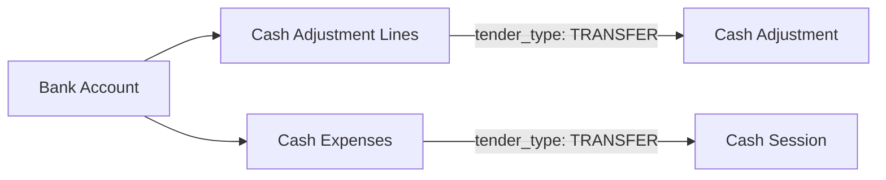

## Overview

**Bank accounts** represent business accounts used for transfer payments in cash adjustments and expenses. They are configured per branch and referenced when `tender_type` is `TRANSFER`.

<Warning>
Store only **masked** account information in the database. Full account numbers and CLABE keys should be stored in secure credential storage.
</Warning>

## Account Fields

From [BankAccount.php:14-22](~/workspace/source/code/api/app/Models/BankAccount.php:14-22):

| Field | Type | Required | Description |
|-------|------|----------|-------------|
| `branch_id` | Foreign Key | Yes | Parent branch |
| `alias` | String | Yes | Friendly name (e.g., "Main Checking") |
| `bank_name` | String | Yes | Financial institution name |
| `account_number_masked` | String | No | Masked account number (e.g., "****1234") |
| `clabe_masked` | String | No | Masked CLABE interbank key (e.g., "************4321") |
| `is_active` | Boolean | Yes | Enable/disable account (default: true) |
| `meta` | JSON | No | Additional metadata |

## Create a Bank Account

### Endpoint

```bash
POST /api/v1/bank-accounts
```

### Request Example

```json
{
  "branch_id": 1,
  "alias": "Main Checking",
  "bank_name": "BBVA",
  "account_number_masked": "****5678",
  "clabe_masked": "************4321",
  "is_active": true,
  "meta": {
    "currency": "MXN",
    "account_type": "checking",
    "routing_number": "****9876"
  }
}
```

### Response

```json
{
  "message": "Bank account created successfully",
  "data": {
    "id": 1,
    "branch_id": 1,
    "alias": "Main Checking",
    "bank_name": "BBVA",
    "account_number_masked": "****5678",
    "clabe_masked": "************4321",
    "is_active": true,
    "meta": {
      "currency": "MXN",
      "account_type": "checking"
    },
    "created_at": "2026-03-06T10:00:00Z",
    "updated_at": "2026-03-06T10:00:00Z"
  }
}
```

## Query Scopes

From [BankAccount.php:55-67](~/workspace/source/code/api/app/Models/BankAccount.php:55-67):

```php
// Filter active accounts
BankAccount::active()->get();

// Filter by branch
BankAccount::byBranch($branchId)->get();
```

### Example Queries

```javascript
// Get all active accounts for a branch
const accounts = await api.get('/bank-accounts', {
  params: {
    branch_id: 1,
    is_active: true
  }
});

// Get all accounts across all branches
const allAccounts = await api.get('/bank-accounts');
```

## Relationships

From [BankAccount.php:32-51](~/workspace/source/code/api/app/Models/BankAccount.php:32-51):

- **branch**: Parent branch
- **adjustmentLines**: All adjustment lines using this account
- **expenses**: All expenses paid from or to this account

### Usage in Transactions



## Linking to Transactions

### In Cash Adjustments

When recording a transfer income:

```json
{
  "cash_session_id": 1,
  "type": "EXTERNAL_IMPORT",
  "direction": "INFLOW",
  "lines": [
    {
      "tender_type": "TRANSFER",
      "amount": 1500.00,
      "currency": "MXN",
      "bank_account_id": 1,
      "reference": "TXN-ABC123"
    }
  ]
}
```

### In Cash Expenses

When paying a bill via transfer:

```json
{
  "cash_session_id": 1,
  "tender_type": "TRANSFER",
  "amount": 650.00,
  "category": "Utilities",
  "vendor": "Electric Company",
  "bank_account_id": 1,
  "reference": "BILL-MARCH-2026"
}
```

<Info>
The `bank_account_id` field is **required** when `tender_type` is `TRANSFER` in either adjustments or expenses.
</Info>

## Account Types

Common account configurations:

### Checking Account

```json
{
  "alias": "Operations Checking",
  "bank_name": "BBVA",
  "account_number_masked": "****1234",
  "meta": {
    "account_type": "checking",
    "currency": "MXN",
    "monthly_fee": 0
  }
}
```

### Savings Account

```json
{
  "alias": "Emergency Fund",
  "bank_name": "Santander",
  "account_number_masked": "****5678",
  "meta": {
    "account_type": "savings",
    "currency": "MXN",
    "interest_rate": 2.5
  }
}
```

### Payroll Account

```json
{
  "alias": "Payroll Account",
  "bank_name": "Banorte",
  "account_number_masked": "****9012",
  "meta": {
    "account_type": "checking",
    "currency": "MXN",
    "purpose": "payroll_only"
  }
}
```

## Security Best Practices

<AccordionGroup>
  <Accordion title="Never Store Full Numbers" icon="shield-halved">
    Always mask account numbers and CLABE keys. Store full credentials in a secure vault (e.g., AWS Secrets Manager, HashiCorp Vault).
    
    ```javascript
    // ❌ WRONG - Never do this
    const account = {
      account_number_masked: "123456789012"
    };
    
    // ✅ CORRECT - Always mask
    const account = {
      account_number_masked: "****9012"
    };
    ```
  </Accordion>
  
  <Accordion title="Limit Field Exposure" icon="eye-slash">
    Don't return sensitive fields in API responses unless absolutely necessary. Use separate endpoints for admin-only credential access.
  </Accordion>
  
  <Accordion title="Audit Access" icon="clipboard-list">
    Log all reads and updates to bank account records for security auditing.
  </Accordion>
  
  <Accordion title="Encrypt Meta Field" icon="lock">
    If storing any sensitive data in `meta`, ensure database-level encryption is enabled for JSON columns.
  </Accordion>
</AccordionGroup>

## Masking Format

Standard masking formats:

| Field | Format | Example |
|-------|--------|---------|
| Account Number | Last 4 digits | `****5678` |
| CLABE (18 digits) | Last 4 digits | `**************4321` |
| Routing Number | Last 4 digits | `****9876` |

```javascript
function maskAccountNumber(fullNumber) {
  if (!fullNumber || fullNumber.length < 4) return '****';
  const lastFour = fullNumber.slice(-4);
  const masked = '*'.repeat(fullNumber.length - 4) + lastFour;
  return masked;
}

// Examples
maskAccountNumber('123456789012'); // "********9012"
maskAccountNumber('012345678901234567'); // "**************4567" (CLABE)
```

## Active/Inactive Management

### Deactivate an Account

Instead of deleting, mark accounts as inactive to preserve transaction history:

```bash
PATCH /api/v1/bank-accounts/{id}
{
  "is_active": false
}
```

### Query Active Accounts Only

```javascript
const activeAccounts = await api.get('/bank-accounts', {
  params: { is_active: true }
});
```

<Warning>
Transactions with `bank_account_id` referencing an inactive account should still display the account details but prevent new transactions from using it.
</Warning>

## Multi-Branch Setup

Each branch should have its own set of accounts:

```javascript
// Branch 1 - Downtown
await api.post('/bank-accounts', {
  branch_id: 1,
  alias: 'Downtown Checking',
  bank_name: 'BBVA',
  account_number_masked: '****1111'
});

await api.post('/bank-accounts', {
  branch_id: 1,
  alias: 'Downtown Savings',
  bank_name: 'BBVA',
  account_number_masked: '****2222'
});

// Branch 2 - Airport
await api.post('/bank-accounts', {
  branch_id: 2,
  alias: 'Airport Checking',
  bank_name: 'Santander',
  account_number_masked: '****3333'
});
```

## Transaction Tracking

### Inflows via Transfer

Track customer transfers or deposits:

```javascript
// Customer made a bank transfer payment
await api.post('/cash-adjustments', {
  cash_session_id: sessionId,
  type: 'EXTERNAL_IMPORT',
  direction: 'INFLOW',
  lines: [
    {
      tender_type: 'TRANSFER',
      amount: 2500.00,
      bank_account_id: 1,
      reference: 'CUSTOMER-TXN-789',
      meta: {
        customer_id: 42,
        order_reference: 'ORD-2026-123'
      }
    }
  ]
});
```

### Outflows via Transfer

Record vendor payments or bill settlements:

```javascript
// Paid utility bill from business account
await api.post('/cash-expenses', {
  cash_session_id: sessionId,
  tender_type: 'TRANSFER',
  amount: 850.00,
  category: 'Utilities',
  vendor: 'Gas Company',
  bank_account_id: 1,
  reference: 'BILL-GAS-MARCH',
  incurred_at: new Date().toISOString()
});
```

## Reporting Queries

### Transfers by Account

```sql
SELECT 
  ba.alias,
  ba.bank_name,
  COUNT(cal.id) as adjustment_line_count,
  SUM(cal.amount) as total_adjustment_amount,
  COUNT(ce.id) as expense_count,
  SUM(ce.amount) as total_expense_amount
FROM bank_accounts ba
LEFT JOIN cash_adjustment_lines cal ON ba.id = cal.bank_account_id
LEFT JOIN cash_expenses ce ON ba.id = ce.bank_account_id
WHERE ba.is_active = true
GROUP BY ba.id, ba.alias, ba.bank_name
ORDER BY total_adjustment_amount DESC;
```

### Monthly Transfer Activity

```sql
SELECT 
  ba.alias,
  DATE_TRUNC('month', cs.operating_date) as month,
  SUM(cal.amount) as inflows,
  SUM(ce.amount) as outflows
FROM bank_accounts ba
LEFT JOIN cash_adjustment_lines cal ON ba.id = cal.bank_account_id
LEFT JOIN cash_adjustments ca ON cal.cash_adjustment_id = ca.id
LEFT JOIN cash_sessions cs ON ca.cash_session_id = cs.id
LEFT JOIN cash_expenses ce ON ba.id = ce.bank_account_id
WHERE ba.is_active = true
  AND cs.operating_date >= '2026-01-01'
GROUP BY ba.id, ba.alias, DATE_TRUNC('month', cs.operating_date)
ORDER BY month DESC, ba.alias;
```

## Metadata Examples

Store additional context in the `meta` field:

### Basic Metadata

```json
{
  "meta": {
    "currency": "MXN",
    "account_type": "checking",
    "opened_date": "2025-01-15"
  }
}
```

### Advanced Metadata

```json
{
  "meta": {
    "currency": "MXN",
    "account_type": "checking",
    "interest_rate": 0.5,
    "monthly_fee": 150.00,
    "minimum_balance": 5000.00,
    "account_manager": "John Doe",
    "account_manager_phone": "+52-555-1234567",
    "online_banking_url": "https://bbva.mx/online",
    "external_sync_enabled": true,
    "last_sync_at": "2026-03-06T08:00:00Z"
  }
}
```

## Best Practices

<AccordionGroup>
  <Accordion title="Consistent Aliases" icon="tag">
    Use clear, descriptive aliases that indicate account purpose: "Main Operations", "Payroll Account", "Emergency Fund"
  </Accordion>
  
  <Accordion title="Regular Review" icon="calendar-check">
    Periodically review and update account information, especially after bank changes or account migrations
  </Accordion>
  
  <Accordion title="Deactivate, Don't Delete" icon="toggle-off">
    Mark accounts as inactive instead of deleting to preserve historical transaction references
  </Accordion>
  
  <Accordion title="One Account Per Branch Minimum" icon="building">
    Ensure each branch has at least one active account configured for transfer operations
  </Accordion>
  
  <Accordion title="Metadata Documentation" icon="book">
    Document your metadata schema so all developers know which fields are expected
  </Accordion>
</AccordionGroup>

## Example: Complete Branch Account Setup

```javascript
// Setup accounts for a new branch
async function setupBranchAccounts(branchId) {
  // Main checking account
  const checking = await api.post('/bank-accounts', {
    branch_id: branchId,
    alias: 'Main Checking',
    bank_name: 'BBVA',
    account_number_masked: '****1234',
    clabe_masked: '**************5678',
    is_active: true,
    meta: {
      account_type: 'checking',
      currency: 'MXN',
      monthly_fee: 150.00
    }
  });

  // Savings account for excess funds
  const savings = await api.post('/bank-accounts', {
    branch_id: branchId,
    alias: 'Savings Account',
    bank_name: 'BBVA',
    account_number_masked: '****9012',
    clabe_masked: '**************3456',
    is_active: true,
    meta: {
      account_type: 'savings',
      currency: 'MXN',
      interest_rate: 2.5
    }
  });

  // Payroll account
  const payroll = await api.post('/bank-accounts', {
    branch_id: branchId,
    alias: 'Payroll Account',
    bank_name: 'Santander',
    account_number_masked: '****7890',
    clabe_masked: '**************1111',
    is_active: true,
    meta: {
      account_type: 'checking',
      currency: 'MXN',
      purpose: 'payroll_only'
    }
  });

  return { checking, savings, payroll };
}
```

## Next Steps

<CardGroup cols={2}>
  <Card title="Cash Adjustments" icon="arrows-rotate" href="/cash/adjustments">
    Use bank accounts in transfer adjustment lines
  </Card>
  
  <Card title="Cash Expenses" icon="receipt" href="/cash/expenses">
    Pay expenses via bank transfer
  </Card>
</CardGroup>
