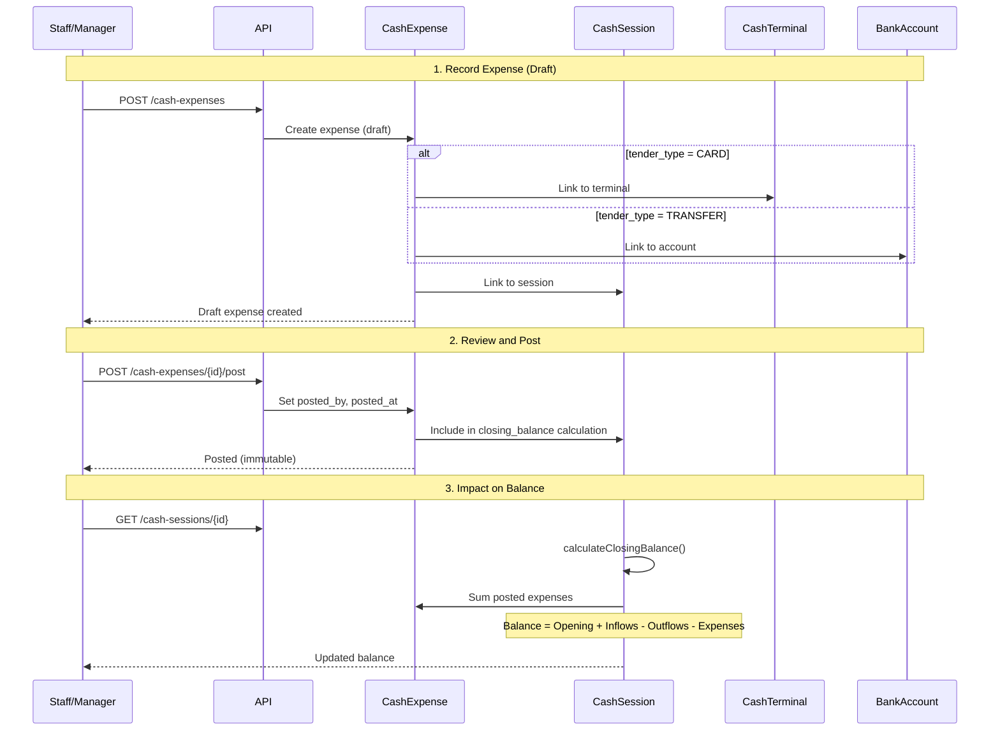

## Overview

**Cash expenses** record operational costs paid directly from cash registers, card terminals, or bank accounts during the operating day. They reduce the session's closing balance and provide visibility into daily spending.

## Expense Fields

From [CashExpense.php:13-28](~/workspace/source/code/api/app/Models/CashExpense.php:13-28):

| Field | Type | Required | Description |
|-------|------|----------|-------------|
| `cash_session_id` | Foreign Key | Yes | Links to the daily session |
| `tender_type` | Enum | Yes | `CASH`, `CARD`, or `TRANSFER` |
| `amount` | Decimal | Yes | Expense amount (4 decimal places) |
| `category` | String | Yes | Expense category (e.g., "Supplies", "Maintenance") |
| `vendor` | String | No | Vendor or supplier name |
| `reference` | String | No | Invoice number or receipt ID |
| `notes` | Text | No | Additional context |
| `card_terminal_id` | Foreign Key | If `CARD` | Terminal used for payment |
| `bank_account_id` | Foreign Key | If `TRANSFER` | Account used for payment |
| `incurred_at` | Timestamp | Yes | When the expense occurred |
| `created_by` | Foreign Key | Yes | User who recorded the expense |
| `posted_by` | Foreign Key | No | User who approved (nullable until posted) |
| `posted_at` | Timestamp | No | When finalized (nullable until posted) |
| `meta` | JSON | No | Custom metadata |

## Tender Types

From [CashExpense.php:37-42](~/workspace/source/code/api/app/Models/CashExpense.php:37-42):

```php
public const TENDER_CASH = 'CASH';
public const TENDER_CARD = 'CARD';
public const TENDER_TRANSFER = 'TRANSFER';
```

| Type | Description | Required Field |
|------|-------------|----------------|
| `CASH` | Paid from register cash drawer | None |
| `CARD` | Charged to card terminal | `card_terminal_id` |
| `TRANSFER` | Paid from bank account | `bank_account_id` |

<Note>
Expenses decrease the session's closing balance regardless of tender type.
</Note>

## Create an Expense

### Endpoint

```bash
POST /api/v1/cash-expenses
```

### Cash Expense Example

```json
{
  "cash_session_id": 1,
  "tender_type": "CASH",
  "amount": 150.00,
  "category": "Supplies",
  "vendor": "Local Supply Store",
  "reference": "INV-2026-123",
  "notes": "Emergency cleaning supplies",
  "incurred_at": "2026-03-06T14:30:00-06:00"
}
```

### Card Expense Example

```json
{
  "cash_session_id": 1,
  "tender_type": "CARD",
  "amount": 250.00,
  "category": "Maintenance",
  "vendor": "Plumbing Service Co.",
  "reference": "INV-PLUMB-456",
  "card_terminal_id": 2,
  "notes": "Urgent sink repair",
  "incurred_at": "2026-03-06T11:00:00-06:00"
}
```

### Transfer Expense Example

```json
{
  "cash_session_id": 1,
  "tender_type": "TRANSFER",
  "amount": 500.00,
  "category": "Utilities",
  "vendor": "Electric Company",
  "reference": "BILL-MARCH-2026",
  "bank_account_id": 1,
  "notes": "Monthly electricity payment",
  "incurred_at": "2026-03-06T09:00:00-06:00"
}
```

<Warning>
- When `tender_type` is `CARD`, `card_terminal_id` is **required**
- When `tender_type` is `TRANSFER`, `bank_account_id` is **required**
- When `tender_type` is `CASH`, both fields should be **null**
</Warning>

## Post an Expense

Posting finalizes the expense and includes it in the session's closing balance calculation.

### Endpoint

```bash
POST /api/v1/cash-expenses/{id}/post
```

```javascript
// Post the expense
const response = await api.post(`/cash-expenses/${expenseId}/post`);

// Response includes posted_by and posted_at
{
  "message": "Expense posted successfully",
  "data": {
    "id": 1,
    "amount": "150.0000",
    "category": "Supplies",
    "posted_by": 5,
    "posted_at": "2026-03-06T23:00:00Z"
  }
}
```

<Info>
Only **posted** expenses are included in the session's `calculateClosingBalance()` method.
</Info>

## Query Scopes

From [CashExpense.php:86-122](~/workspace/source/code/api/app/Models/CashExpense.php:86-122):

```php
// Filter by status
CashExpense::posted()->get();
CashExpense::draft()->get();

// Filter by category
CashExpense::byCategory('Supplies')->get();

// Filter by tender type
CashExpense::byTenderType('CASH')->get();

// Filter by date range
CashExpense::byDateRange('2026-03-01', '2026-03-31')->get();
```

## Helper Methods

### Status Check

From [CashExpense.php:126-130](~/workspace/source/code/api/app/Models/CashExpense.php:126-130):

```php
$expense->isPosted(); // Returns true if posted_at is not null
```

### Tender Type Checks

From [CashExpense.php:133-155](~/workspace/source/code/api/app/Models/CashExpense.php:133-155):

```php
$expense->isCash();     // true if tender_type === CASH
$expense->isCard();     // true if tender_type === CARD
$expense->isTransfer(); // true if tender_type === TRANSFER
```

## Relationships

From [CashExpense.php:47-82](~/workspace/source/code/api/app/Models/CashExpense.php:47-82):

- **cashSession**: Parent session
- **cardTerminal**: Terminal for `CARD` expenses (nullable)
- **bankAccount**: Account for `TRANSFER` expenses (nullable)
- **createdBy**: User who recorded the expense
- **postedBy**: User who approved the expense (nullable until posted)

## Expense Categories

Common expense categories:

| Category | Description | Examples |
|----------|-------------|----------|
| `Supplies` | Operating supplies | Cleaning products, paper goods, packaging |
| `Maintenance` | Equipment and facility repairs | Plumbing, HVAC, appliance repair |
| `Utilities` | Regular utility bills | Electricity, water, internet |
| `Delivery` | Delivery-related costs | Gas, vehicle maintenance, courier fees |
| `Marketing` | Promotional expenses | Flyers, local advertising |
| `Miscellaneous` | Other operational costs | Licenses, permits, small equipment |

<Info>
Categories are free-form strings. Consider defining a standard list in your application config.
</Info>

## Workflow Diagram



## Use Cases

### Emergency Supply Purchase

Pay cash from register for urgent supplies:

```json
{
  "cash_session_id": 1,
  "tender_type": "CASH",
  "amount": 75.00,
  "category": "Supplies",
  "vendor": "Local Hardware Store",
  "reference": "RECEIPT-789",
  "notes": "Emergency light bulbs - main dining area",
  "incurred_at": "2026-03-06T15:00:00-06:00"
}
```

### Service Charge via Terminal

Pay for repair using card terminal:

```json
{
  "cash_session_id": 1,
  "tender_type": "CARD",
  "amount": 320.00,
  "category": "Maintenance",
  "vendor": "HVAC Specialists",
  "reference": "SVC-2026-045",
  "card_terminal_id": 1,
  "notes": "AC unit maintenance - kitchen area",
  "incurred_at": "2026-03-06T10:30:00-06:00"
}
```

### Utility Payment via Bank

Pay monthly bill from business account:

```json
{
  "cash_session_id": 1,
  "tender_type": "TRANSFER",
  "amount": 650.00,
  "category": "Utilities",
  "vendor": "City Water Department",
  "reference": "BILL-MARCH-2026",
  "bank_account_id": 1,
  "notes": "Monthly water bill",
  "incurred_at": "2026-03-06T09:00:00-06:00"
}
```

## Impact on Session Balance

Expenses reduce the closing balance:

```javascript
// Session with opening balance
const session = {
  opening_balance: 500.00,
  status: 'DRAFT'
};

// Record income adjustment
await api.post('/cash-adjustments', {
  cash_session_id: session.id,
  direction: 'INFLOW',
  lines: [
    { tender_type: 'CASH', amount: 2000.00 }
  ]
});

// Record expense
await api.post('/cash-expenses', {
  cash_session_id: session.id,
  tender_type: 'CASH',
  amount: 150.00,
  category: 'Supplies'
});

// Closing balance calculation:
// 500 (opening) + 2000 (inflows) - 0 (outflows) - 150 (expenses) = 2350
```

## Best Practices

<AccordionGroup>
  <Accordion title="Receipt Tracking" icon="file-invoice">
    Always capture invoice/receipt numbers in the `reference` field for audit trails
  </Accordion>
  
  <Accordion title="Timely Recording" icon="clock">
    Record expenses when they occur (use `incurred_at`), even if posting happens later
  </Accordion>
  
  <Accordion title="Vendor Names" icon="store">
    Use consistent vendor names to enable spending analysis by supplier
  </Accordion>
  
  <Accordion title="Category Standards" icon="tags">
    Define standard categories in your application to ensure consistent reporting
  </Accordion>
  
  <Accordion title="Approval Workflow" icon="user-check">
    Keep expenses as drafts until reviewed by a manager, then post with their user ID
  </Accordion>
  
  <Accordion title="Tender Matching" icon="equals">
    Match tender type to actual payment method - use CARD for terminal charges, not CASH
  </Accordion>
</AccordionGroup>

## Batch Recording

Record multiple expenses at once:

```javascript
const expenses = [
  {
    tender_type: 'CASH',
    amount: 50.00,
    category: 'Supplies',
    vendor: 'Office Depot',
    notes: 'Printer paper'
  },
  {
    tender_type: 'CASH',
    amount: 25.00,
    category: 'Supplies',
    vendor: 'Local Market',
    notes: 'Coffee for staff room'
  },
  {
    tender_type: 'CARD',
    amount: 180.00,
    category: 'Maintenance',
    vendor: 'Locksmith',
    card_terminal_id: 1,
    notes: 'Replace back door lock'
  }
];

// Create all expenses
const created = await Promise.all(
  expenses.map(expense => 
    api.post('/cash-expenses', {
      cash_session_id: sessionId,
      incurred_at: new Date().toISOString(),
      ...expense
    })
  )
);

// Post all after review
await Promise.all(
  created.map(({ data }) => 
    api.post(`/cash-expenses/${data.id}/post`)
  )
);
```

## Reporting Queries

### Expenses by Category

```sql
SELECT 
  category,
  COUNT(*) as expense_count,
  SUM(amount) as total_amount
FROM cash_expenses
WHERE posted_at IS NOT NULL
  AND incurred_at >= '2026-03-01'
  AND incurred_at < '2026-04-01'
GROUP BY category
ORDER BY total_amount DESC;
```

### Expenses by Vendor

```sql
SELECT 
  vendor,
  category,
  COUNT(*) as transaction_count,
  SUM(amount) as total_spent
FROM cash_expenses
WHERE posted_at IS NOT NULL
  AND vendor IS NOT NULL
GROUP BY vendor, category
ORDER BY total_spent DESC;
```

### Daily Expense Trend

```sql
SELECT 
  DATE(incurred_at) as expense_date,
  tender_type,
  COUNT(*) as expense_count,
  SUM(amount) as total_amount
FROM cash_expenses
WHERE posted_at IS NOT NULL
  AND incurred_at >= '2026-03-01'
GROUP BY DATE(incurred_at), tender_type
ORDER BY expense_date DESC, tender_type;
```

## Error Handling

<CodeGroup>
```json Missing Terminal ID
{
  "message": "Validation error",
  "errors": {
    "card_terminal_id": [
      "The card_terminal_id field is required when tender_type is CARD"
    ]
  }
}
```

```json Already Posted
{
  "message": "Expense already posted and cannot be modified",
  "code": "ALREADY_POSTED"
}
```

```json Invalid Session
{
  "message": "Cash session not found",
  "code": "SESSION_NOT_FOUND"
}
```

```json Negative Amount
{
  "message": "Validation error",
  "errors": {
    "amount": [
      "The amount must be greater than 0"
    ]
  }
}
```
</CodeGroup>

## Next Steps

<CardGroup cols={2}>
  <Card title="Cash Sessions" icon="calendar-day" href="/cash/sessions">
    See how expenses affect session closing balance
  </Card>
  
  <Card title="Bank Accounts" icon="building-columns" href="/cash/bank-accounts">
    Configure accounts for transfer expenses
  </Card>
</CardGroup>
