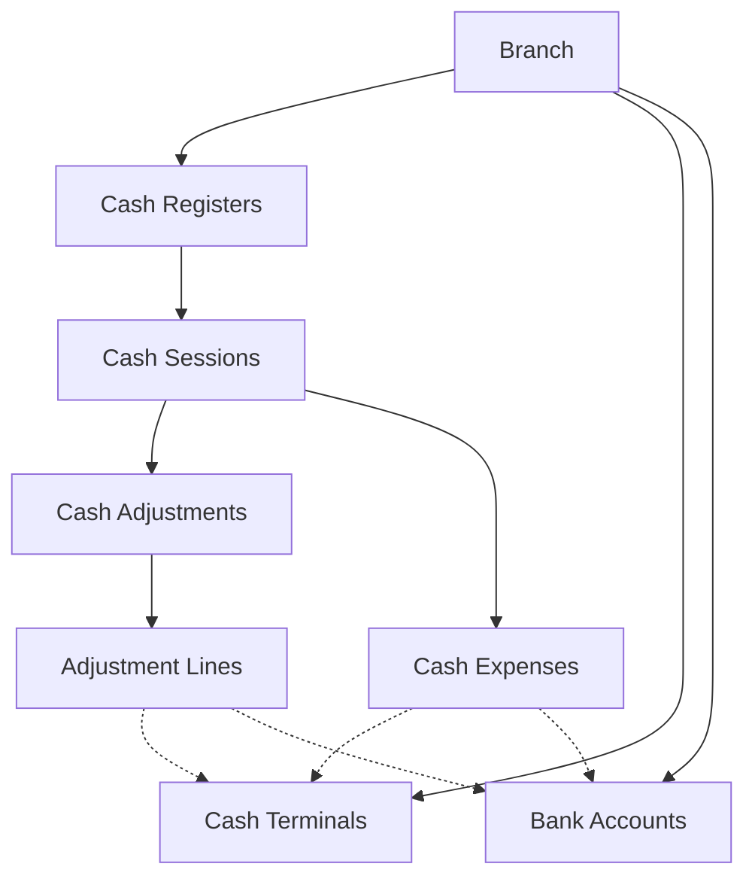
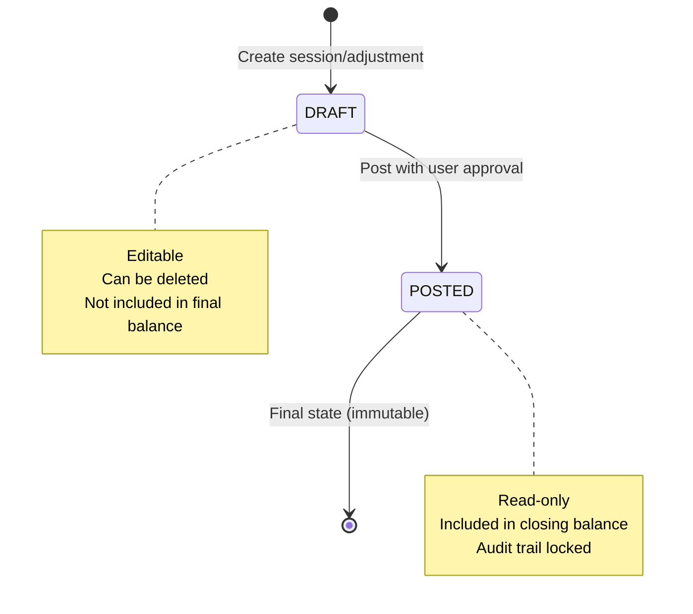

## Introduction

The SushiGo cash management system provides end-of-day financial tracking for multi-location restaurant operations. It captures daily income totals by tender type (cash, card, transfer) across multiple registers, terminals, and bank accounts.

<Note>
This system records **daily totals** from external POS systems, not individual ticket-level transactions.
</Note>

## Core Concepts

### Cash Sessions

A **cash session** represents a single operating day for a specific cash register. Each session:
- Tracks opening and closing balances
- Contains all income adjustments and expenses for that day
- Must be unique per register and date
- Has a lifecycle: `DRAFT` → `POSTED`

### Cash Registers

Physical or logical registers that process transactions. Types include:
- **ON_PREMISE**: Store register for dine-in service
- **DELIVERY**: Register for delivery operations
- **EVENT**: Temporary register for special events

### Tender Types

Transactions are categorized by payment method:
- **CASH**: Physical currency
- **CARD**: Card payments via terminals
- **TRANSFER**: Bank transfers

## Key Features

<CardGroup cols={2}>
  <Card title="Multi-Register Support" icon="cash-register">
    Manage multiple registers per branch with distinct workflows for on-premise, delivery, and events
  </Card>
  
  <Card title="Tender Breakdown" icon="credit-card">
    Track income and expenses by tender type with automatic terminal and account linking
  </Card>
  
  <Card title="Session Lifecycle" icon="rotate">
    Draft → Posted workflow with balance calculations and variance detection
  </Card>
  
  <Card title="Audit Trail" icon="clipboard-list">
    Complete traceability with user tracking, timestamps, and source system references
  </Card>
</CardGroup>

## System Architecture

## Data Model Overview

| Entity | Purpose | Key Fields |
|--------|---------|------------|
| `CashRegister` | Register catalog per branch | `code`, `name`, `type`, `branch_id` |
| `CashTerminal` | Card terminal tracking | `name`, `provider`, `last_four` |
| `BankAccount` | Transfer destination accounts | `alias`, `bank_name`, `clabe_masked` |
| `CashSession` | Daily operating session | `operating_date`, `status`, `opening_balance`, `closing_balance` |
| `CashAdjustment` | Income/outflow header | `type`, `direction`, `source_system` |
| `CashAdjustmentLine` | Tender-level breakdown | `tender_type`, `amount`, `terminal_id`, `bank_account_id` |
| `CashExpense` | Operating expenses | `tender_type`, `amount`, `category`, `vendor` |

## Workflow Overview

<Steps>
  <Step title="Setup">
    Configure cash registers, terminals, and bank accounts for each branch
  </Step>
  
  <Step title="Open Session">
    Create or retrieve the cash session for the operating date
  </Step>
  
  <Step title="Capture Income">
    Import daily totals from external POS, broken down by tender type
  </Step>
  
  <Step title="Record Expenses">
    Log operational expenses paid from registers or terminals
  </Step>
  
  <Step title="Post Session">
    Finalize the session, calculating closing balance and locking transactions
  </Step>
  
  <Step title="Reconcile">
    Review reports by register, tender type, and date range
  </Step>
</Steps>

## Status Flow

Cash sessions and adjustments follow a simple two-state lifecycle:

## Permissions

Suggested permissions for access control:
- `cash-registers.manage` - Create and configure registers
- `cash-terminals.manage` - Manage card terminals
- `cash-adjustments.create` - Record daily income
- `cash-adjustments.post` - Finalize adjustments
- `cash-expenses.create` - Log operational expenses
- `cash-expenses.post` - Approve and lock expenses

<Info>
Use the existing `OperatingUnitUser` scoping to restrict access to registers tied to specific branches or units.
</Info>

## Next Steps

<CardGroup cols={2}>
  <Card title="Cash Sessions" icon="calendar-day" href="/cash/sessions">
    Learn about session lifecycle and balance calculations
  </Card>
  
  <Card title="Registers & Terminals" icon="cash-register" href="/cash/registers-and-terminals">
    Set up registers, terminals, and bank accounts
  </Card>
  
  <Card title="Cash Adjustments" icon="arrows-rotate" href="/cash/adjustments">
    Record income and corrections with approval workflow
  </Card>
  
  <Card title="Cash Expenses" icon="receipt" href="/cash/expenses">
    Track operational expenses by category and vendor
  </Card>
</CardGroup>
