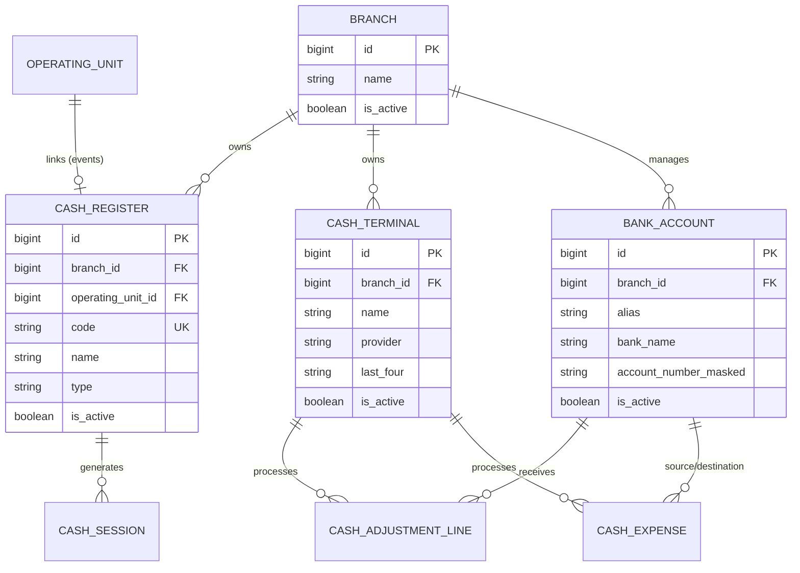

## Overview

SushiGo supports multiple cash registers per branch, each with distinct workflows for on-premise, delivery, and event operations. Card terminals and bank accounts are configured per branch and linked to transactions via tender lines.

## Cash Registers

### Register Types

From [CashRegister.php:29-34](~/workspace/source/code/api/app/Models/CashRegister.php:29-34):

```php
public const TYPE_ON_PREMISE = 'ON_PREMISE';
public const TYPE_DELIVERY = 'DELIVERY';
public const TYPE_EVENT = 'EVENT';
```

| Type | Description | Use Case |
|------|-------------|----------|
| `ON_PREMISE` | Store register for dine-in service | Main counter, bar, or service station |
| `DELIVERY` | Register for delivery operations | Separate tracking for delivery/takeout |
| `EVENT` | Temporary register for special events | Catering, festivals, pop-ups |

<Note>
Event registers can be linked to an `OperatingUnit` for temporary tracking outside the main branch.
</Note>

### Register Fields

| Field | Type | Description |
|-------|------|-------------|
| `branch_id` | Foreign Key | Parent branch (required) |
| `operating_unit_id` | Foreign Key | Optional link to event unit |
| `code` | String | Unique identifier (e.g., "REG-001") |
| `name` | String | Display name (e.g., "Main Counter") |
| `type` | Enum | `ON_PREMISE`, `DELIVERY`, or `EVENT` |
| `is_active` | Boolean | Enable/disable register |
| `meta` | JSON | Custom data (e.g., external system IDs) |

### Create a Register

```json
POST /cash-registers
{
  "branch_id": 1,
  "code": "REG-MAIN",
  "name": "Main Counter",
  "type": "ON_PREMISE",
  "is_active": true,
  "meta": {
    "external_id": "POS-001"
  }
}
```

### Query Scopes

From [CashRegister.php:62-82](~/workspace/source/code/api/app/Models/CashRegister.php:62-82):

```php
// Filter active registers
CashRegister::active()->get();

// Filter by branch
CashRegister::byBranch($branchId)->get();

// Filter by type
CashRegister::byType('ON_PREMISE')->get();
```

### Helper Methods

```php
$register->isOnPremise(); // true if type === ON_PREMISE
$register->isDelivery();  // true if type === DELIVERY
$register->isEvent();     // true if type === EVENT
```

### Relationships

- **branch**: Parent branch [CashRegister.php:39-42](~/workspace/source/code/api/app/Models/CashRegister.php:39-42)
- **operatingUnit**: Optional event unit [CashRegister.php:47-50](~/workspace/source/code/api/app/Models/CashRegister.php:47-50)
- **sessions**: All cash sessions [CashRegister.php:55-58](~/workspace/source/code/api/app/Models/CashRegister.php:55-58)

---

## Cash Terminals

Card terminals process card payments and must be linked to adjustment lines or expenses via `card_terminal_id`.

### Terminal Fields

| Field | Type | Description |
|-------|------|-------------|
| `branch_id` | Foreign Key | Parent branch |
| `name` | String | Terminal name or alias (e.g., "Terminal A") |
| `provider` | String | Payment processor (e.g., "Stripe", "Clip") |
| `account_ref` | String | Merchant ID or account reference |
| `last_four` | String | Last 4 digits of terminal serial/account |
| `is_active` | Boolean | Enable/disable terminal |
| `meta` | JSON | Additional metadata (fees, commission rates) |

### Create a Terminal

```json
POST /cash-terminals
{
  "branch_id": 1,
  "name": "Terminal A - Main",
  "provider": "Clip",
  "account_ref": "MERCHANT-12345",
  "last_four": "6789",
  "is_active": true,
  "meta": {
    "commission_rate": 3.5,
    "settlement_days": 2
  }
}
```

### Query Scopes

From [CashTerminal.php:54-75](~/workspace/source/code/api/app/Models/CashTerminal.php:54-75):

```php
// Filter active terminals
CashTerminal::active()->get();

// Filter by branch
CashTerminal::byBranch($branchId)->get();

// Filter by provider
CashTerminal::byProvider('Clip')->get();
```

### Relationships

- **branch**: Parent branch [CashTerminal.php:32-35](~/workspace/source/code/api/app/Models/CashTerminal.php:32-35)
- **adjustmentLines**: Transactions using this terminal [CashTerminal.php:40-43](~/workspace/source/code/api/app/Models/CashTerminal.php:40-43)
- **expenses**: Expenses paid via this terminal [CashTerminal.php:48-51](~/workspace/source/code/api/app/Models/CashTerminal.php:48-51)

<Info>
When creating a cash adjustment line with `tender_type: 'CARD'`, you must provide a valid `card_terminal_id`.
</Info>

---

## Bank Accounts

Bank accounts receive transfer payments and are referenced in adjustment lines or expenses with `tender_type: 'TRANSFER'`.

### Account Fields

| Field | Type | Description |
|-------|------|-------------|
| `branch_id` | Foreign Key | Parent branch |
| `alias` | String | Friendly name (e.g., "Main Checking") |
| `bank_name` | String | Financial institution name |
| `account_number_masked` | String | Masked account number (e.g., "****1234") |
| `clabe_masked` | String | Masked CLABE (Mexican interbank key) |
| `is_active` | Boolean | Enable/disable account |
| `meta` | JSON | Additional metadata |

<Warning>
Store full account numbers and CLABE keys in secure credential storage, not in the database. Only masked values should be persisted.
</Warning>

### Create a Bank Account

```json
POST /bank-accounts
{
  "branch_id": 1,
  "alias": "Main Checking",
  "bank_name": "BBVA",
  "account_number_masked": "****5678",
  "clabe_masked": "************4321",
  "is_active": true,
  "meta": {
    "currency": "MXN",
    "account_type": "checking"
  }
}
```

### Query Scopes

From [BankAccount.php:55-67](~/workspace/source/code/api/app/Models/BankAccount.php:55-67):

```php
// Filter active accounts
BankAccount::active()->get();

// Filter by branch
BankAccount::byBranch($branchId)->get();
```

### Relationships

- **branch**: Parent branch [BankAccount.php:32-35](~/workspace/source/code/api/app/Models/BankAccount.php:32-35)
- **adjustmentLines**: Transfers to this account [BankAccount.php:40-43](~/workspace/source/code/api/app/Models/BankAccount.php:40-43)
- **expenses**: Transfers from this account [BankAccount.php:48-51](~/workspace/source/code/api/app/Models/BankAccount.php:48-51)

---

## Setup Workflow

<Steps>
  <Step title="Create Registers">
    Set up cash registers for each branch by type (on-premise, delivery, event)
    
    ```bash
    POST /cash-registers
    {
      "branch_id": 1,
      "code": "REG-001",
      "name": "Main Counter",
      "type": "ON_PREMISE"
    }
    ```
  </Step>
  
  <Step title="Register Terminals">
    Add card terminals with provider details and account references
    
    ```bash
    POST /cash-terminals
    {
      "branch_id": 1,
      "name": "Terminal A",
      "provider": "Clip",
      "account_ref": "MERCHANT-12345"
    }
    ```
  </Step>
  
  <Step title="Configure Bank Accounts">
    Register bank accounts for transfer payments
    
    ```bash
    POST /bank-accounts
    {
      "branch_id": 1,
      "alias": "Main Checking",
      "bank_name": "BBVA",
      "account_number_masked": "****5678"
    }
    ```
  </Step>
  
  <Step title="Link in Transactions">
    Reference terminals and accounts when creating adjustment lines or expenses
    
    ```bash
    POST /cash-adjustments
    {
      "lines": [
        {
          "tender_type": "CARD",
          "amount": 500.00,
          "card_terminal_id": 1  // Links to Terminal A
        },
        {
          "tender_type": "TRANSFER",
          "amount": 300.00,
          "bank_account_id": 1  // Links to Main Checking
        }
      ]
    }
    ```
  </Step>
</Steps>

## Multi-Branch Configuration

Each branch should have:

<CardGroup cols={3}>
  <Card title="Registers" icon="cash-register">
    1+ per operational type (on-premise, delivery, event)
  </Card>
  
  <Card title="Terminals" icon="credit-card">
    1+ card terminals with provider details
  </Card>
  
  <Card title="Accounts" icon="building-columns">
    1+ bank accounts for transfers
  </Card>
</CardGroup>

### Example: Branch Setup

```javascript
// Branch 1: Downtown Location
const branch1Registers = [
  { code: 'REG-001', name: 'Main Counter', type: 'ON_PREMISE' },
  { code: 'REG-002', name: 'Delivery Station', type: 'DELIVERY' }
];

const branch1Terminals = [
  { name: 'Terminal A', provider: 'Clip', account_ref: 'MERCHANT-001' },
  { name: 'Terminal B', provider: 'Clip', account_ref: 'MERCHANT-001' }
];

const branch1Accounts = [
  { alias: 'Main Checking', bank_name: 'BBVA', clabe_masked: '************1234' }
];
```

## Entity Relationships



## Best Practices

<AccordionGroup>
  <Accordion title="Register Naming" icon="tag">
    Use clear, descriptive names that indicate location and purpose: "Kitchen Counter", "Bar Register", "Delivery Hub"
  </Accordion>
  
  <Accordion title="Terminal Tracking" icon="hashtag">
    Store the last four digits of terminal serial numbers for easy physical identification
  </Accordion>
  
  <Accordion title="Account Security" icon="shield">
    Never store full account numbers in `account_number_masked` or `clabe_masked`. Use masked versions only.
  </Accordion>
  
  <Accordion title="Active Status" icon="toggle-on">
    Mark registers, terminals, or accounts as inactive instead of deleting to preserve historical transaction links
  </Accordion>
  
  <Accordion title="Event Registers" icon="calendar-star">
    Link event registers to temporary `OperatingUnit` records for proper scoping and cleanup
  </Accordion>
</AccordionGroup>

## Next Steps

<CardGroup cols={2}>
  <Card title="Cash Sessions" icon="calendar-day" href="/cash/sessions">
    Create and manage daily cash sessions
  </Card>
  
  <Card title="Cash Adjustments" icon="arrows-rotate" href="/cash/adjustments">
    Record income with tender breakdown
  </Card>
</CardGroup>
