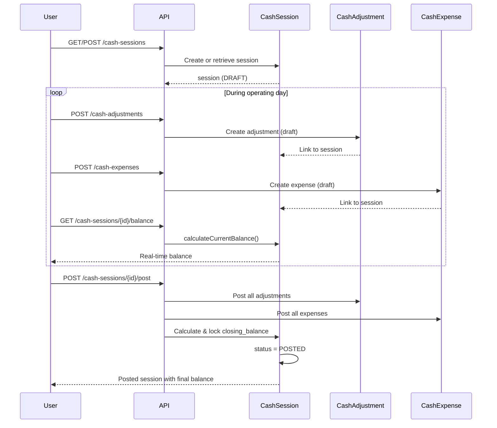

## Overview

A **cash session** represents a single operating day for a specific cash register. It serves as the container for all income adjustments and expenses occurring during that day.

## Session Structure

### Core Fields

| Field | Type | Description |
|-------|------|-------------|
| `cash_register_id` | Foreign Key | Links to the register (see [CashRegister.php:38](~/workspace/source/code/api/app/Models/CashRegister.php:38)) |
| `operating_date` | Date | The business date for this session |
| `status` | Enum | `DRAFT` or `POSTED` |
| `opening_balance` | Decimal | Optional starting cash amount (nullable) |
| `closing_balance` | Decimal | Calculated final balance after all transactions |
| `meta` | JSON | Additional metadata (e.g., external batch ID) |

<Note>
The combination of `cash_register_id` and `operating_date` is unique - you can only have one session per register per day.
</Note>

### Status Constants

From [CashSession.php:31-33](~/workspace/source/code/api/app/Models/CashSession.php:31-33):

```php
public const STATUS_DRAFT = 'DRAFT';
public const STATUS_POSTED = 'POSTED';
```

## Session Lifecycle

<Steps>
  <Step title="Create Draft Session">
    Initialize session for a register and operating date with status `DRAFT`
    
    ```json
    {
      "cash_register_id": 1,
      "operating_date": "2026-03-06",
      "status": "DRAFT",
      "opening_balance": 500.00
    }
    ```
  </Step>
  
  <Step title="Record Transactions">
    Add cash adjustments (income) and expenses during the day
    
    - All transactions remain editable while session is `DRAFT`
    - Real-time balance available via `calculateCurrentBalance()`
  </Step>
  
  <Step title="Post Session">
    Finalize the session by setting status to `POSTED`
    
    - Marks all adjustments and expenses as posted
    - Calculates and locks `closing_balance`
    - Records `posted_by` user and `posted_at` timestamp
  </Step>
  
  <Step title="Reconciliation">
    Review posted session for reporting and audit
    
    - Session becomes immutable
    - Included in financial reports
  </Step>
</Steps>

## Balance Calculations

### Closing Balance (Posted Transactions Only)

The official closing balance includes only **posted** transactions. From [CashSession.php:118-146](~/workspace/source/code/api/app/Models/CashSession.php:118-146):

```php
public function calculateClosingBalance(): float
{
    $opening = (float) ($this->opening_balance ?? 0);

    // Sum posted inflow adjustments only
    $inflows = $this->adjustments()
        ->posted()
        ->where('direction', CashAdjustment::DIRECTION_INFLOW)
        ->with('lines')
        ->get()
        ->sum(function ($adjustment) {
            return $adjustment->lines->sum('amount');
        });

    // Sum posted outflow adjustments only
    $outflows = $this->adjustments()
        ->posted()
        ->where('direction', CashAdjustment::DIRECTION_OUTFLOW)
        ->with('lines')
        ->get()
        ->sum(function ($adjustment) {
            return $adjustment->lines->sum('amount');
        });

    // Sum posted expenses only
    $expensesTotal = $this->expenses()->posted()->sum('amount');

    return $opening + $inflows - $outflows - $expensesTotal;
}
```

**Formula:**
```
Closing Balance = Opening Balance + Inflows - Outflows - Expenses
```

### Current Balance (Including Drafts)

For real-time display during the day, calculate balance including draft transactions. From [CashSession.php:148-182](~/workspace/source/code/api/app/Models/CashSession.php:148-182):

```php
public function calculateCurrentBalance(): float
{
    $opening = $this->opening_balance ? (float) $this->opening_balance : 0.0;

    // Sum ALL inflow adjustments (including drafts)
    $inflows = 0.0;
    $inflowAdjustments = $this->adjustments()
        ->where('direction', CashAdjustment::DIRECTION_INFLOW)
        ->with('lines')
        ->get();

    foreach ($inflowAdjustments as $adjustment) {
        $inflows += (float) $adjustment->lines->sum('amount');
    }

    // Sum ALL outflow adjustments (including drafts)
    // ... similar logic for outflows

    // Sum ALL expenses (including drafts)
    $expensesTotal = (float) $this->expenses()->sum('amount');

    return $opening + $inflows - $outflows - $expensesTotal;
}
```

<Warning>
`calculateCurrentBalance()` is for real-time UI display only. Use `calculateClosingBalance()` for official reporting and posting.
</Warning>

## Relationships

### Belongs To

- **cashRegister**: Links to [CashRegister.php:38-41](~/workspace/source/code/api/app/Models/CashRegister.php:38-41)

### Has Many

- **adjustments**: All cash adjustments for this session [CashSession.php:46-49](~/workspace/source/code/api/app/Models/CashSession.php:46-49)
- **expenses**: All expenses recorded in this session [CashSession.php:54-57](~/workspace/source/code/api/app/Models/CashSession.php:54-57)

## Query Scopes

Useful scopes from [CashSession.php:61-97](~/workspace/source/code/api/app/Models/CashSession.php:61-97):

```php
// Filter by status
CashSession::draft()->get();
CashSession::posted()->get();

// Filter by register
CashSession::byRegister($registerId)->get();

// Filter by date
CashSession::byDate('2026-03-06')->get();
CashSession::byDateRange('2026-03-01', '2026-03-31')->get();
```

## Helper Methods

### Status Checks

```php
$session->isDraft();  // Returns true if status === 'DRAFT'
$session->isPosted(); // Returns true if status === 'POSTED'
```

## Session Workflow Diagram



## Best Practices

<AccordionGroup>
  <Accordion title="Opening Balance" icon="coins">
    Set `opening_balance` when starting a new session if you have a float. Leave null for event or delivery registers that start at zero.
  </Accordion>
  
  <Accordion title="Posting Timing" icon="clock">
    Post sessions at end-of-day after all adjustments and expenses are recorded. Once posted, the session becomes immutable.
  </Accordion>
  
  <Accordion title="Draft Management" icon="file-pen">
    Use `calculateCurrentBalance()` to show operators their running total during the day, but rely on `calculateClosingBalance()` for official close.
  </Accordion>
  
  <Accordion title="Variance Handling" icon="triangle-exclamation">
    If closing balance doesn't match physical count, create a correction adjustment (type `CORRECTION`) before posting.
  </Accordion>
</AccordionGroup>

## Example: Daily Close Flow

```javascript
// 1. Get or create session for today
const session = await api.post('/cash-sessions', {
  cash_register_id: 1,
  operating_date: '2026-03-06',
  opening_balance: 500.00
});

// 2. Import sales from external POS
await api.post('/cash-adjustments', {
  cash_session_id: session.id,
  type: 'EXTERNAL_IMPORT',
  direction: 'INFLOW',
  source_system: 'ExternalPOS',
  lines: [
    { tender_type: 'CASH', amount: 1250.00 },
    { tender_type: 'CARD', amount: 3400.00, card_terminal_id: 2 }
  ]
});

// 3. Record an expense
await api.post('/cash-expenses', {
  cash_session_id: session.id,
  tender_type: 'CASH',
  amount: 150.00,
  category: 'Supplies',
  vendor: 'Local Vendor'
});

// 4. Check current balance
const { current_balance } = await api.get(`/cash-sessions/${session.id}/balance`);
console.log(`Current: ${current_balance}`); // 500 + 4650 - 150 = 5000

// 5. Post session to finalize
await api.post(`/cash-sessions/${session.id}/post`);
```

## Next Steps

<CardGroup cols={2}>
  <Card title="Cash Adjustments" icon="arrows-rotate" href="/cash/adjustments">
    Learn how to record income and corrections
  </Card>
  
  <Card title="Cash Expenses" icon="receipt" href="/cash/expenses">
    Track operational expenses during sessions
  </Card>
</CardGroup>
