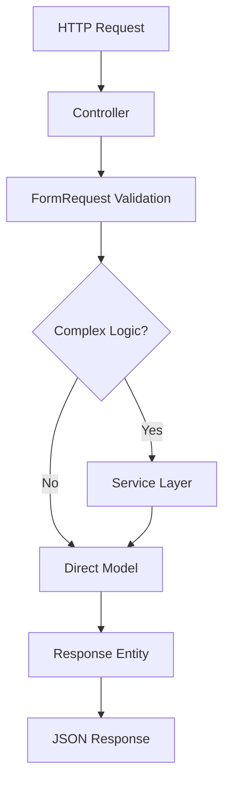
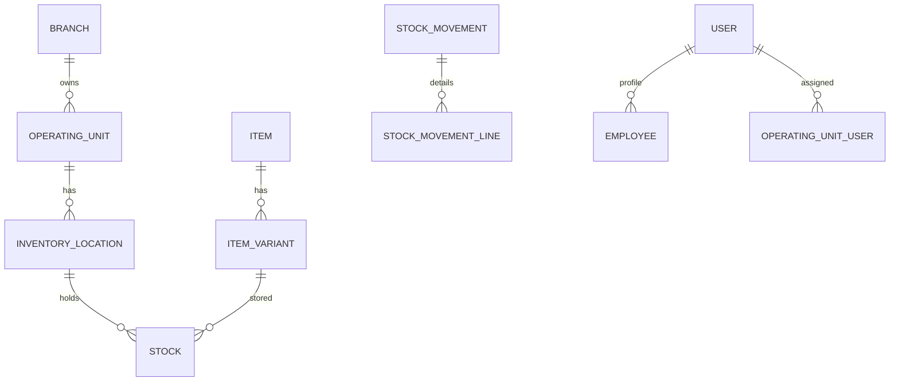

## Overview

SushiGo is built as a **monorepo** containing a Laravel 12 API backend and a React 19 webapp frontend. The system follows domain-driven design principles with a focus on inventory management, multi-location operations, and complete traceability.

## Monorepo Structure

```
sushigo/
├── code/
│   ├── api/              # Laravel 12 API (PHP 8.2)
│   │   ├── app/
│   │   │   ├── Actions/
│   │   │   ├── Http/Controllers/Api/V1/
│   │   │   ├── Models/
│   │   │   ├── Services/
│   │   │   └── ...
│   │   ├── routes/api.php
│   │   └── ...
│   └── webapp/           # React 19 Webapp (TypeScript)
│       ├── src/
│       │   ├── pages/
│       │   ├── components/
│       │   ├── services/
│       │   └── stores/
│       └── ...
├── doc/                  # Architecture & specifications
└── docker-compose.yml
```

## Backend Architecture (Laravel API)

### Single Action Controller Pattern

SushiGo uses **Single Action Controllers (SAC)** - each controller handles exactly one HTTP action via `__invoke()`:

```php
// ✅ One controller, one action
class CreateItemController extends Controller
{
    public function __invoke(CreateItemRequest $request)
    {
        $item = Item::create($request->validated());
        
        return new ResponseEntity(
            data: [...],
            status: 201
        );
    }
}
```

**Benefits:**
- Clear responsibility boundaries
- Easier to test and maintain
- No method bloat
- Self-documenting route definitions

**Controller organization:**
```
app/Http/Controllers/Api/V1/
├── Items/
│   ├── CreateItemController.php
│   ├── ListItemsController.php
│   ├── ShowItemController.php
│   ├── UpdateItemController.php
│   └── DeleteItemController.php
├── Inventory/
│   ├── RegisterOpeningBalanceController.php
│   └── RegisterStockOutController.php
└── Employees/
    ├── CreateEmployeeController.php
    ├── ListEmployeesController.php
    └── ...
```

### Layered Architecture



| Layer | Responsibility | Location |
|-------|---------------|----------|
| **Controllers** | Receive requests, validate, delegate | `app/Http/Controllers/Api/V1/` |
| **FormRequests** | Input validation, sanitization | `app/Http/Requests/` |
| **Services** | Business logic orchestration | `app/Services/` |
| **Actions** | Reusable domain operations | `app/Actions/` |
| **Models** | Data access, relationships | `app/Models/` |
| **Responses** | Output formatting | `app/Http/Responses/` |

**Example service:**
```php
class OpeningBalanceService
{
    public function register(
        InventoryLocation $location,
        ItemVariant $variant,
        float $quantity,
        UnitOfMeasure $uom
    ): Stock {
        // Convert to base UOM
        $baseQty = $this->convertToBase($quantity, $uom, $variant);
        
        // Create/update stock
        $stock = Stock::updateOrCreate([...]);
        
        // Record movement for traceability
        StockMovement::create([...]);
        
        return $stock;
    }
}
```

## Domain Model

### Core Entities



#### Branch
Physical or administrative branch of the organization. Each branch groups permanent and temporary inventories.

```php
// code/api/app/Models/Branch.php
class Branch extends Model
{
    public function operatingUnits(): HasMany;
    public function activeOperatingUnits(): HasMany;
}
```

**Fields:** `code`, `name`, `region`, `timezone`, `is_active`

#### OperatingUnit
Operational context within a branch - either a permanent inventory or a temporary event.

```php
// code/api/app/Models/OperatingUnit.php
class OperatingUnit extends Model
{
    const TYPE_BRANCH_MAIN = 'BRANCH_MAIN';
    const TYPE_BRANCH_BUFFER = 'BRANCH_BUFFER';
    const TYPE_EVENT_TEMP = 'EVENT_TEMP';
    
    public function branch(): BelongsTo;
    public function inventoryLocations(): HasMany;
    public function users(): BelongsToMany;
}
```

**Types:**
- `BRANCH_MAIN` - Primary branch inventory
- `BRANCH_BUFFER` - Auxiliary warehouse
- `BRANCH_RETURN` - Return staging area
- `EVENT_TEMP` - Temporary event inventory

See [Operating Units](/core/operating-units) for detailed coverage.

#### InventoryLocation
Physical or logical zones within each operating unit (Main, Kitchen, Bar, Waste, etc.).

```php
// code/api/app/Models/InventoryLocation.php
class InventoryLocation extends Model
{
    const TYPE_MAIN = 'MAIN';
    const TYPE_KITCHEN = 'KITCHEN';
    const TYPE_BAR = 'BAR';
    const TYPE_WASTE = 'WASTE';
    
    public function operatingUnit(): BelongsTo;
    public function stock(): HasMany;
}
```

**Fields:** `name`, `type`, `is_primary`, `priority`

#### Item & ItemVariant
Master catalog of products. An `Item` represents a product (e.g., "Salmon Nigiri"), while `ItemVariant` represents specific versions (e.g., "6-piece tray").

```php
// code/api/app/Models/Item.php
class Item extends Model
{
    const TYPE_INSUMO = 'INSUMO';      // Supply/ingredient
    const TYPE_PRODUCTO = 'PRODUCTO';   // Finished product
    const TYPE_ACTIVO = 'ACTIVO';       // Asset
    
    public function variants(): HasMany;
    public function isInsumo(): bool;
}
```

**Item types:**
- **INSUMO** - Supplies and ingredients (allows multiple UOM conversions)
- **PRODUCTO** - Finished products (1:1 UOM)
- **ACTIVO** - Assets and equipment (1:1 UOM)

#### Stock & StockMovement
Stock records track `on_hand` and `reserved` quantities per location/variant. Every stock change generates a `StockMovement` for complete traceability.

```php
// code/api/app/Models/Stock.php
class Stock extends Model
{
    // Fields: on_hand, reserved
    public function inventoryLocation(): BelongsTo;
    public function itemVariant(): BelongsTo;
}

// code/api/app/Models/StockMovement.php
class StockMovement extends Model
{
    // Reasons: TRANSFER, RETURN, SALE, ADJUSTMENT, CONSUMPTION
    public function lines(): HasMany;
}
```

**Movement reasons:**
- `TRANSFER` - Between locations
- `RETURN` - Stock returns
- `SALE` - Sales consumption
- `ADJUSTMENT` - Manual corrections
- `CONSUMPTION` - Waste/usage
- `OPENING_BALANCE` - Initial stock

#### Employee & User
**User** is the authenticated identity (holds credentials and permissions). **Employee** is the work profile (name, code, position) linked to a User.

```php
// code/api/app/Models/User.php
class User extends Authenticatable
{
    use HasApiTokens, HasRoles;  // Spatie Permissions
    
    protected $guard_name = 'api';
}

// code/api/app/Models/Employee.php
class Employee extends Model
{
    const POSITION_ROLES = ['manager', 'cook', 'kitchen-assistant', ...];
    
    public function user(): BelongsTo;
    public function syncPositionRoles(array $roleNames): void;
}
```

See [Authentication](/core/authentication) and [Permissions](/core/permissions) for details.

## Service Layer Organization

Services encapsulate complex business logic and orchestrate operations across multiple models.

```
app/Services/
├── Inventory/
│   ├── OpeningBalanceService.php
│   └── StockOutService.php
├── CashAdjustments/
│   ├── CashSessionService.php
│   └── CashExpenseService.php
└── Notifications/
    └── WhatsAppService.php
```

**When to use services:**
- Multi-step transactions
- Cross-domain operations
- Complex business rules
- External API integrations

**When NOT to use services:**
- Simple CRUD operations (use controllers directly)
- Single model updates
- Basic queries

## API Versioning Strategy

All API routes are versioned under `/api/v1/`:

```php
// routes/api.php
Route::prefix('v1')->group(function () {
    // Auth routes
    Route::post('auth/login', LoginController::class);
    
    // Protected routes
    Route::middleware('auth:api')->group(function () {
        Route::get('items', ListItemsController::class);
        Route::post('items', CreateItemController::class);
    });
});
```

**URL structure:** `https://api.sushigo.com/api/v1/{resource}`

**Version strategy:**
- Current: `v1` (Laravel 12 + Passport)
- Future versions add new prefixes: `v2`, `v3`
- Old versions maintained for backward compatibility
- Breaking changes require new version

## Frontend Architecture (React Webapp)

### File-Based Routing

Uses TanStack Router with file-based routing - each page exports its own route configuration:

```tsx
// src/pages/inventory/index.tsx
import { createFileRoute } from '@tanstack/react-router'

export const Route = createFileRoute('/inventory/')({
  component: InventoryPage,
})

function InventoryPage() {
  return <div>Inventory Management</div>
}
```

**Route structure:**
```
src/pages/
├── __root.tsx              # Root layout
├── index.tsx               # Home page
├── inventory/
│   ├── index.tsx           # /inventory
│   ├── items.tsx           # /inventory/items
│   └── stock.tsx           # /inventory/stock
└── cash/
    └── sessions.tsx        # /cash/sessions
```

### State Management

- **Auth state:** Zustand store (`stores/auth.store.ts`)
- **Server state:** TanStack Query
- **Local UI state:** React hooks

```tsx
// API service with TanStack Query
export function useItemsList() {
  return useQuery({
    queryKey: ['items'],
    queryFn: () => apiClient.get('/items').then(r => r.data),
  })
}
```

### API Client

Axios instance with automatic token injection:

```tsx
// lib/api-client.ts
const apiClient = axios.create({
  baseURL: import.meta.env.VITE_API_URL,
})

apiClient.interceptors.request.use((config) => {
  const token = authStore.getState().token
  if (token) {
    config.headers.Authorization = `Bearer ${token}`
  }
  return config
})
```

## Design Principles

| Principle | Implementation |
|-----------|---------------|
| **Single Tenant Scope** | All data belongs to SushiGo tenant |
| **Operating Unit Abstraction** | Every operation occurs within an operating unit |
| **Inventory by Location** | Stock segregated by physical/logical locations |
| **Complete Traceability** | Every movement generates audit records |
| **Service-Oriented Layering** | Thin controllers → Services → Models |
| **Strong Typing** | PHP 8.2 types + TypeScript |
| **Secure IDs** | Internal IDs, external exposure via Hashids |

## Technology Stack

**Backend:**
- Laravel 12 (PHP 8.2)
- PostgreSQL 16
- Laravel Passport (OAuth2)
- Spatie Permissions
- L5 Swagger (OpenAPI docs)

**Frontend:**
- React 19
- TypeScript
- TanStack Router + Query
- Zustand
- Tailwind CSS
- Vite

**Infrastructure:**
- Docker Compose (development)
- Nginx (reverse proxy)
- Mailhog (email testing)
- PgAdmin (database management)

## Related Documentation

<CardGroup cols={2}>
  <Card title="Operating Units" icon="building" href="/core/operating-units">
    Multi-location inventory isolation
  </Card>
  <Card title="Authentication" icon="lock" href="/core/authentication">
    OAuth2 password grant flow
  </Card>
  <Card title="Permissions" icon="shield" href="/core/permissions">
    Role-based access control
  </Card>
  <Card title="API Reference" icon="code" href="/api-reference/introduction">
    Complete endpoint documentation
  </Card>
</CardGroup>
