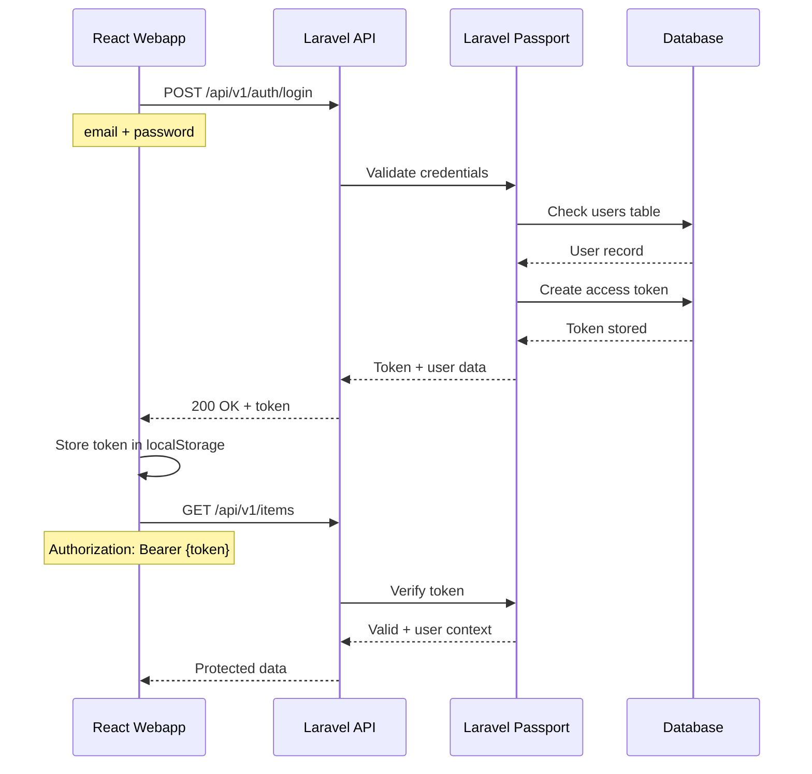

## Overview

SushiGo uses **Laravel Passport** for OAuth2 authentication with a **password grant** flow. This allows users to authenticate with email/phone and password to receive access tokens for API requests.

## Authentication Flow



## Password Grant Implementation

### Login Request

**Endpoint:** `POST /api/v1/auth/login`

**Request body:**
```json
{
  "email": "admin@sushigo.com",
  "password": "admin123456"
}
```

**Response:**
```json
{
  "data": {
    "user": {
      "id": 1,
      "name": "Admin User",
      "email": "admin@sushigo.com",
      "roles": ["admin"]
    },
    "token": {
      "access_token": "eyJ0eXAiOiJKV1QiLCJhbGc...",
      "token_type": "Bearer",
      "expires_in": 31536000
    }
  },
  "status": 200,
  "message": "Login successful"
}
```

### Controller Implementation

From `code/api/app/Http/Controllers/Api/V1/Auth/LoginController.php`:

```php
use Laravel\Passport\Client as OAuthClient;

class LoginController extends Controller
{
    public function __invoke(LoginRequest $request)
    {
        // Find user by email
        $user = User::where('email', $request->email)->first();
        
        if (!$user || !Hash::check($request->password, $user->password)) {
            throw ValidationException::withMessages([
                'email' => ['The provided credentials are incorrect.'],
            ]);
        }
        
        // Get password grant client
        $client = OAuthClient::where('password_client', true)->first();
        
        // Request token from Passport
        $response = Http::asForm()->post(url('/oauth/token'), [
            'grant_type' => 'password',
            'client_id' => $client->id,
            'client_secret' => $client->secret,
            'username' => $request->email,
            'password' => $request->password,
            'scope' => '',
        ]);
        
        $tokenData = $response->json();
        
        return new ResponseEntity([
            'user' => [
                'id' => $user->id,
                'name' => $user->name,
                'email' => $user->email,
                'roles' => $user->getRoleNames(),
            ],
            'token' => $tokenData,
        ]);
    }
}
```

## Token Management

### Access Tokens

**Characteristics:**
- Bearer tokens (JWT format)
- Default expiration: 1 year (31536000 seconds)
- Stored in `oauth_access_tokens` table
- Passed in `Authorization` header

**Client-side storage:**

```typescript
// src/stores/auth.store.ts
import { create } from 'zustand'
import { persist } from 'zustand/middleware'

interface AuthState {
  token: string | null
  user: User | null
  setAuth: (token: string, user: User) => void
  clearAuth: () => void
}

export const useAuthStore = create<AuthState>()(
  persist(
    (set) => ({
      token: null,
      user: null,
      setAuth: (token, user) => set({ token, user }),
      clearAuth: () => set({ token: null, user: null }),
    }),
    {
      name: 'auth-storage',  // localStorage key
    }
  )
)
```

### Automatic Token Injection

The webapp's API client automatically injects the token:

```typescript
// src/lib/api-client.ts
import axios from 'axios'
import { useAuthStore } from '@/stores/auth.store'

const apiClient = axios.create({
  baseURL: import.meta.env.VITE_API_URL,
})

// Request interceptor - add token to all requests
apiClient.interceptors.request.use((config) => {
  const token = useAuthStore.getState().token
  
  if (token) {
    config.headers.Authorization = `Bearer ${token}`
  }
  
  return config
})

// Response interceptor - handle 401 Unauthorized
apiClient.interceptors.response.use(
  (response) => response,
  (error) => {
    if (error.response?.status === 401) {
      useAuthStore.getState().clearAuth()
      window.location.href = '/login'
    }
    return Promise.reject(error)
  }
)

export default apiClient
```

## Login/Logout Endpoints

### Login

**POST** `/api/v1/auth/login`

**Request:**
```json
{
  "email": "user@sushigo.com",
  "password": "password123"
}
```

**Success Response (200):**
```json
{
  "data": {
    "user": {
      "id": 5,
      "name": "John Doe",
      "email": "john@sushigo.com",
      "roles": ["inventory-manager"]
    },
    "token": {
      "access_token": "eyJ0eXAiOiJKV1QiLCJh...",
      "token_type": "Bearer",
      "expires_in": 31536000
    }
  },
  "status": 200
}
```

**Error Response (422):**
```json
{
  "message": "The provided credentials are incorrect.",
  "errors": {
    "email": ["The provided credentials are incorrect."]
  },
  "status": 422
}
```

### Logout

**POST** `/api/v1/auth/logout`

**Headers:**
```
Authorization: Bearer {access_token}
```

**Controller implementation:**

```php
// code/api/app/Http/Controllers/Api/V1/Auth/LogoutController.php
class LogoutController extends Controller
{
    public function __invoke(Request $request)
    {
        // Revoke all tokens for the authenticated user
        $request->user()->tokens()->delete();
        
        return new ResponseEntity(
            data: ['message' => 'Successfully logged out'],
            status: 200
        );
    }
}
```

**Response:**
```json
{
  "data": {
    "message": "Successfully logged out"
  },
  "status": 200
}
```

### Get Current User

**GET** `/api/v1/auth/me`

Returns the authenticated user's profile and roles.

**Headers:**
```
Authorization: Bearer {access_token}
```

**Response:**
```json
{
  "data": {
    "id": 5,
    "name": "John Doe",
    "email": "john@sushigo.com",
    "roles": ["inventory-manager"],
    "permissions": [
      "items.create",
      "items.update",
      "stock.view"
    ]
  },
  "status": 200
}
```

## Token Refresh

Laravel Passport tokens have a 1-year expiration by default. Token refresh is not currently implemented, but can be added using OAuth2's `refresh_token` grant.

**Future implementation:**

```php
POST /oauth/token
Content-Type: application/x-www-form-urlencoded

grant_type=refresh_token
&refresh_token={refresh_token}
&client_id={client_id}
&client_secret={client_secret}
```

<Note>
Token expiration is configured in `config/passport.php`:

```php
'tokens_expire_in' => 365 * 24 * 60,  // 1 year in minutes
'refresh_tokens_expire_in' => 365 * 24 * 60,
```
</Note>

## Password Reset Flow

### 1. Request Reset Token

**POST** `/api/v1/auth/forgot-password`

```json
{
  "email": "user@sushigo.com"
}
```

Generates a reset token and sends it via email (or SMS if phone-based).

### 2. Verify Reset Token

**POST** `/api/v1/auth/verify-reset-token`

```json
{
  "email": "user@sushigo.com",
  "token": "123456"
}
```

Validates that the token is correct and not expired.

### 3. Reset Password

**POST** `/api/v1/auth/reset-password`

```json
{
  "email": "user@sushigo.com",
  "token": "123456",
  "password": "newPassword123",
  "password_confirmation": "newPassword123"
}
```

## User Model

The `User` model integrates Laravel Passport and Spatie Permissions:

```php
// code/api/app/Models/User.php
use Laravel\Passport\HasApiTokens;
use Spatie\Permission\Traits\HasRoles;

class User extends Authenticatable
{
    use HasApiTokens, HasRoles, Notifiable;
    
    protected $guard_name = 'api';  // Passport guard
    
    protected $fillable = [
        'name',
        'email',
        'phone',
        'phone_country',
        'password',
    ];
    
    protected $hidden = [
        'password',
        'remember_token',
    ];
    
    // Get assigned operating units
    public function operatingUnits()
    {
        return $this->belongsToMany(
            OperatingUnit::class,
            'operating_unit_users'
        );
    }
}
```

**Key traits:**
- `HasApiTokens` - Laravel Passport integration
- `HasRoles` - Spatie Permissions role management
- `Notifiable` - Email/SMS notifications

## Protected Routes

All protected routes use the `auth:api` middleware:

```php
// code/api/routes/api.php
Route::middleware('auth:api')->group(function () {
    // User routes
    Route::get('auth/me', MeController::class);
    Route::post('auth/logout', LogoutController::class);
    
    // Protected resources
    Route::get('items', ListItemsController::class);
    Route::post('items', CreateItemController::class);
});
```

**Middleware behavior:**
1. Extract token from `Authorization` header
2. Query `oauth_access_tokens` table
3. Load associated User model
4. Make user available via `$request->user()` or `auth()->user()`
5. Reject request with 401 if token invalid/expired

## Frontend Login Implementation

```tsx
// src/pages/login.tsx
import { useAuthStore } from '@/stores/auth.store'
import apiClient from '@/lib/api-client'

function LoginPage() {
  const setAuth = useAuthStore((s) => s.setAuth)
  
  async function handleLogin(values: { email: string; password: string }) {
    const response = await apiClient.post('/auth/login', values)
    const { user, token } = response.data.data
    
    setAuth(token.access_token, user)
    
    // Redirect to dashboard
    navigate({ to: '/' })
  }
  
  return (
    <form onSubmit={handleSubmit(handleLogin)}>
      <input {...register('email')} type="email" />
      <input {...register('password')} type="password" />
      <button type="submit">Login</button>
    </form>
  )
}
```

## Security Considerations

<AccordionGroup>
  <Accordion title="Token Storage">
    - Tokens stored in localStorage (persistent across sessions)
    - Alternative: sessionStorage (cleared on tab close)
    - Consider httpOnly cookies for enhanced security
    - Never expose tokens in URLs or logs
  </Accordion>

  <Accordion title="HTTPS Required">
    - All authentication must occur over HTTPS
    - Tokens transmitted in plaintext in Authorization header
    - Production deployment requires SSL/TLS certificates
  </Accordion>

  <Accordion title="Rate Limiting">
    - Login endpoint should be rate-limited
    - Laravel default: 5 attempts per minute per email
    - Configure in `app/Http/Kernel.php` throttle middleware
  </Accordion>

  <Accordion title="Token Revocation">
    - Logout revokes all user tokens
    - Manual revocation via `User::tokens()->delete()`
    - Expired tokens automatically cleaned by Passport
  </Accordion>
</AccordionGroup>

## Development Users

Default test accounts (from seeders):

| Email | Password | Role |
|-------|----------|------|
| superadmin@sushigo.com | admin123456 | super-admin |
| admin@sushigo.com | admin123456 | admin |
| inventory@sushigo.com | inventory123456 | inventory-manager |

<Warning>
These credentials are for development only. In production:
- Generate strong passwords
- Enforce password complexity rules
- Enable 2FA for admin accounts
- Rotate credentials regularly
</Warning>

## Troubleshooting

### 401 Unauthorized

**Cause:** Token invalid, expired, or missing

**Solutions:**
- Verify token in Authorization header: `Bearer {token}`
- Check token hasn't expired (1 year default)
- Ensure user still exists and is active
- Verify Passport tables exist: `oauth_access_tokens`, `oauth_clients`

### Token Not Found in Database

**Cause:** Passport not installed or migrations not run

**Solution:**
```bash
php artisan passport:install
php artisan passport:keys
```

### CORS Errors

**Cause:** Frontend and API on different domains

**Solution:**
Configure CORS in `config/cors.php`:
```php
'paths' => ['api/*', 'oauth/*'],
'allowed_origins' => [env('FRONTEND_URL', 'http://localhost:5173')],
```

## Related Documentation

<CardGroup cols={2}>
  <Card title="Permissions" icon="shield" href="/core/permissions">
    Role-based authorization
  </Card>
  <Card title="User Management" icon="users" href="/employees/overview">
    Creating and managing users
  </Card>
  <Card title="API Reference" icon="code" href="/api-reference/auth/login">
    Auth endpoint documentation
  </Card>
  <Card title="System Architecture" icon="sitemap" href="/core/architecture">
    Overall system design
  </Card>
</CardGroup>
