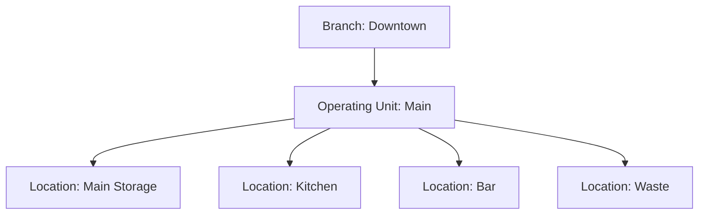
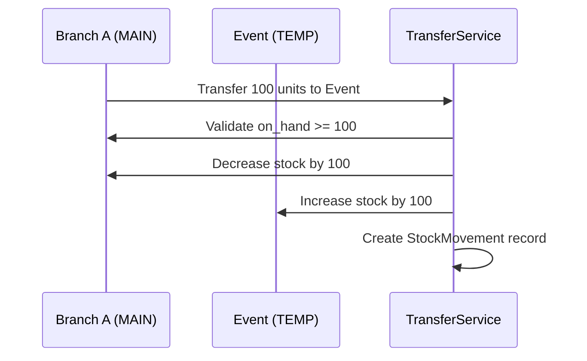

## What Are Operating Units?

An **Operating Unit** is the operational context within which inventory operations occur. It represents either a **permanent branch inventory** or a **temporary event** that requires isolated stock management.

Think of an Operating Unit as a "business location" that:
- Maintains its own inventory
- Records its own sales and expenses
- Has assigned staff members
- Operates independently for accounting and profitability tracking

## Operating Unit Types

### BRANCH_MAIN
The primary inventory for a permanent branch location.

**Characteristics:**
- Permanent (no end date)
- One per branch
- Main stock holding location
- Source for transfers to events

**Example:**
```php
OperatingUnit::create([
    'branch_id' => 1,
    'name' => 'Downtown Main Inventory',
    'type' => OperatingUnit::TYPE_BRANCH_MAIN,
    'is_active' => true,
    'start_date' => now(),
    'end_date' => null,
]);
```

### BRANCH_BUFFER
Auxiliary warehouse or buffer storage within a branch.

**Use cases:**
- Dry storage separate from main kitchen
- Cold storage warehouse
- Backup inventory location

**Example:**
```php
OperatingUnit::create([
    'branch_id' => 1,
    'name' => 'Dry Storage Warehouse',
    'type' => OperatingUnit::TYPE_BRANCH_BUFFER,
    'is_active' => true,
]);
```

### BRANCH_RETURN
Staging area for returns and damaged goods.

**Use cases:**
- Vendor return processing
- Damaged item quarantine
- Quality control holding

### EVENT_TEMP
Temporary event inventory for catering, pop-ups, or festivals.

**Characteristics:**
- Temporary (has start and end dates)
- Linked to a source branch
- Independent profit/loss tracking
- Stock returns to source after closure

**Example:**
```php
OperatingUnit::create([
    'branch_id' => 1,
    'name' => 'Food Truck Festival - March 2026',
    'type' => OperatingUnit::TYPE_EVENT_TEMP,
    'start_date' => '2026-03-15',
    'end_date' => '2026-03-17',
    'is_active' => true,
    'meta' => [
        'location' => 'Central Park',
        'expected_attendance' => 5000,
    ],
]);
```

## Inventory Isolation

Each Operating Unit maintains **completely isolated inventory**. Stock in one unit cannot be directly used in another without an explicit transfer.

### Inventory Locations

Within each Operating Unit, inventory is further divided into **Inventory Locations**:



**Example from codebase:**

```php
// code/api/app/Models/OperatingUnit.php
public function inventoryLocations(): HasMany
{
    return $this->hasMany(InventoryLocation::class);
}

public function primaryLocation()
{
    return $this->inventoryLocations()
        ->where('is_primary', true)
        ->first();
}
```

### Stock Records

Stock is tracked at the `InventoryLocation` level, not the Operating Unit level:

```php
// Stock is tied to a specific location
Stock::create([
    'inventory_location_id' => $mainLocation->id,
    'item_variant_id' => $salmonSku->id,
    'on_hand' => 50.0,
    'reserved' => 10.0,
]);
```

**Key insight:** When you query "How much salmon does the Downtown branch have?", you're aggregating across all locations within that branch's Operating Units.

## User Assignment to Operating Units

Staff members are assigned to Operating Units through the `operating_unit_users` pivot table:

```php
// code/api/app/Models/OperatingUnit.php
public function users(): BelongsToMany
{
    return $this->belongsToMany(User::class, 'operating_unit_users')
        ->withPivot('assignment_role', 'is_active', 'meta')
        ->withTimestamps();
}
```

### Assignment Roles

Users can be assigned with different roles per Operating Unit:

| Role | Capabilities |
|------|-------------|
| `OWNER` | Full control over the operating unit |
| `MANAGER` | Operational management, reporting |
| `CASHIER` | Sales and cash operations |
| `INVENTORY` | Stock management and counts |
| `AUDITOR` | Read-only access for audits |

**Example assignment:**

```php
// Assign a user as inventory manager for an event
$operatingUnit->users()->attach($user->id, [
    'assignment_role' => 'INVENTORY',
    'is_active' => true,
    'meta' => [
        'assigned_by' => auth()->id(),
        'assignment_date' => now(),
    ],
]);
```

<Note>
Assignment roles are **contextual** - the same user might be `MANAGER` in one Operating Unit and `INVENTORY` in another. These are separate from the user's system-wide roles (admin, super-admin, etc.).
</Note>

## Real Examples from the Codebase

### Creating an Operating Unit

From the API controller:

```php
// code/api/app/Http/Controllers/Api/V1/OperatingUnit/CreateOperatingUnitController.php
public function __invoke(CreateOperatingUnitRequest $request)
{
    $operatingUnit = OperatingUnit::create([
        'branch_id' => $request->branch_id,
        'name' => $request->name,
        'type' => $request->type,
        'start_date' => $request->start_date,
        'end_date' => $request->end_date,
        'is_active' => true,
    ]);
    
    return new ResponseEntity(data: $operatingUnit, status: 201);
}
```

### Querying Active Operating Units

```php
// Get all active main branch units
$mainUnits = OperatingUnit::active()
    ->mainBranch()
    ->with(['branch', 'inventoryLocations'])
    ->get();

// Get active events happening now
$activeEvents = OperatingUnit::activeEvents()->get();
```

**Scopes available:**

```php
// code/api/app/Models/OperatingUnit.php:87
public function scopeActive($query)
{
    return $query->where('is_active', true);
}

public function scopeMainBranch($query)
{
    return $query->where('type', self::TYPE_BRANCH_MAIN);
}

public function scopeActiveEvents($query)
{
    return $query->where('type', self::TYPE_EVENT_TEMP)
        ->where('is_active', true)
        ->where('start_date', '<=', now())
        ->where(function ($q) {
            $q->whereNull('end_date')
                ->orWhere('end_date', '>=', now());
        });
}
```

### Checking Operating Unit Type

```php
// code/api/app/Models/OperatingUnit.php:133
if ($operatingUnit->isEvent()) {
    // Handle temporary event logic
    $closure = EventClosure::create([...]);
}

if ($operatingUnit->isMainBranch()) {
    // Main branch operations
}
```

## Transfers Between Operating Units

Stock can be transferred between Operating Units (even across different branches):



**Example transfer:**

```php
StockMovement::create([
    'from_location_id' => $mainWarehouse->id,  // Branch A
    'to_location_id' => $eventStorage->id,     // Event
    'item_variant_id' => $variant->id,
    'qty' => 100,
    'reason' => 'TRANSFER',
    'related_id' => null,
    'meta' => [
        'transferred_by' => auth()->id(),
        'notes' => 'Initial stock for festival event',
    ],
]);
```

<Warning>
Inter-branch transfers require careful validation:
- Source must have sufficient stock
- Units must allow transfers (not locked)
- Proper authorization for cross-branch operations
</Warning>

## Event Lifecycle

### 1. Create Event Operating Unit
```php
$event = OperatingUnit::create([
    'branch_id' => $mainBranch->id,
    'type' => OperatingUnit::TYPE_EVENT_TEMP,
    'name' => 'Summer Festival 2026',
    'start_date' => '2026-06-15',
    'end_date' => '2026-06-20',
]);
```

### 2. Transfer Stock from Main Branch
```php
// Move inventory from main to event
$transferService->move(
    from: $mainBranch->primaryLocation(),
    to: $event->primaryLocation(),
    items: [
        ['variant_id' => 1, 'qty' => 200],
        ['variant_id' => 2, 'qty' => 150],
    ]
);
```

### 3. Record Sales and Expenses During Event
```php
Sale::create([
    'operating_unit_id' => $event->id,
    'total' => 1500.00,
    // ... sale lines
]);

Expense::create([
    'operating_unit_id' => $event->id,
    'category' => 'Logistics',
    'amount' => 250.00,
]);
```

### 4. Close Event and Return Stock
```php
// Final count and closure
$closureService->closeEvent($event);

// Returns remaining stock to main branch
// Generates profitability report
EventClosure::create([
    'operating_unit_id' => $event->id,
    'closed_at' => now(),
    'kpis' => [
        'total_sales' => 15000.00,
        'total_expenses' => 3500.00,
        'net_profit' => 11500.00,
        'items_sold' => 450,
        'waste_percentage' => 3.2,
    ],
]);
```

## Profitability Tracking

Each Operating Unit maintains independent financial records:

**Per Operating Unit:**
- Sales revenue
- Operating expenses
- Stock consumption
- Waste/loss
- Net profit/loss

**Aggregated per Branch:**
- Combined revenue across all Operating Units
- Branch-level expense allocation
- Overall branch profitability

**Database schema:**

```sql
-- Sales tied to operating unit
CREATE TABLE sales (
    id BIGSERIAL PRIMARY KEY,
    operating_unit_id BIGINT REFERENCES operating_units(id),
    total DECIMAL(10,2),
    created_at TIMESTAMP
);

-- Expenses tied to operating unit
CREATE TABLE expenses (
    id BIGSERIAL PRIMARY KEY,
    operating_unit_id BIGINT REFERENCES operating_units(id),
    category VARCHAR(255),
    amount DECIMAL(10,2),
    created_at TIMESTAMP
);
```

## Best Practices

<AccordionGroup>
  <Accordion title="When to create a new Operating Unit">
    - **New permanent branch location** → Create `BRANCH_MAIN`
    - **Temporary event/catering** → Create `EVENT_TEMP`
    - **Separate warehouse** → Create `BRANCH_BUFFER`
    - **NOT for minor stock movements** → Use Inventory Locations instead
  </Accordion>

  <Accordion title="Stock transfer guidelines">
    - Always validate source stock availability
    - Record `StockMovement` with clear reason codes
    - Include metadata (who, why, related document)
    - Use transactions for multi-item transfers
    - Log transfers in audit system
  </Accordion>

  <Accordion title="Event management">
    - Set realistic start/end dates
    - Pre-plan stock requirements
    - Assign dedicated staff before event start
    - Track expenses in real-time
    - Perform final count before closure
    - Archive event data, don't delete
  </Accordion>
</AccordionGroup>

## API Endpoints

### List Operating Units
```http
GET /api/v1/operating-units
```

### Create Operating Unit
```http
POST /api/v1/operating-units
Content-Type: application/json

{
  "branch_id": 1,
  "name": "Summer Festival 2026",
  "type": "EVENT_TEMP",
  "start_date": "2026-06-15",
  "end_date": "2026-06-20"
}
```

### Assign User to Operating Unit
```http
POST /api/v1/operating-units/{id}/users
Content-Type: application/json

{
  "user_id": 5,
  "assignment_role": "INVENTORY"
}
```

See the [API Reference](/api-reference/operating-units/list) for complete endpoint documentation.

## Related Documentation

<CardGroup cols={2}>
  <Card title="System Architecture" icon="sitemap" href="/core/architecture">
    Overall technical architecture
  </Card>
  <Card title="Stock Management" icon="boxes-stacked" href="/inventory/stock-movements">
    Managing inventory and movements
  </Card>
  <Card title="API Reference" icon="code" href="/api-reference/operating-units/list">
    Operating Unit endpoints
  </Card>
  <Card title="Permissions" icon="shield" href="/core/permissions">
    Access control for Operating Units
  </Card>
</CardGroup>
