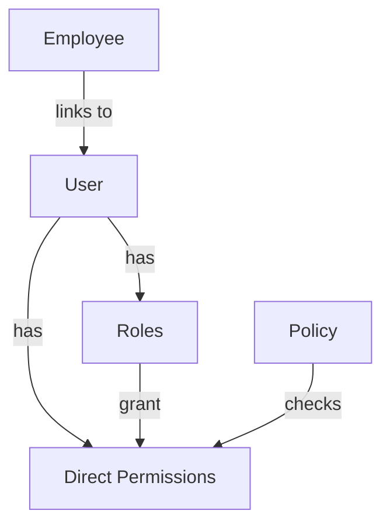
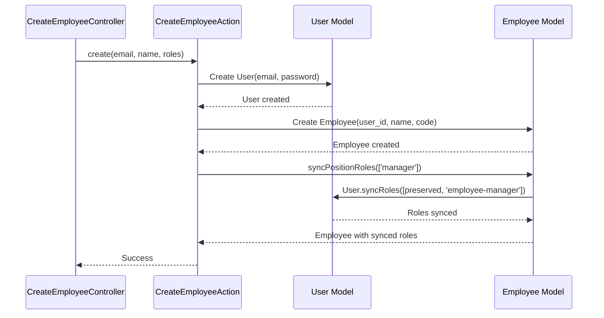

## Overview

SushiGo uses **Spatie Laravel Permission** for role-based access control (RBAC). The permission system operates on the **User** model (not Employee) with the `api` guard for Laravel Passport integration.

## Core Principle

```
User = authenticated identity → holds roles and permissions
Employee = work profile → has NO roles directly
```

**Key insight:** Roles and permissions are **always assigned to User**, never to Employee. An Employee record links to a User, and that User carries the authorization context.

## Permission Model



### Database Tables

Spatie Permission creates these tables:

- `roles` - Role definitions
- `permissions` - Permission definitions
- `model_has_roles` - User → Role assignments
- `model_has_permissions` - User → Direct permission assignments
- `role_has_permissions` - Role → Permission mappings

## System Roles

All roles operate on the `api` guard and are assigned to **User** models.

### System-Level Roles

| Role | Employee Profile | Description | Base Permissions |
|------|------------------|-------------|------------------|
| `super-admin` | ❌ No | Full system access. Technical account. | All (`*`) |
| `admin` | ✅ Yes | Full operational management. | `users.*`, `employees.*`, `items.*`, `inventory.*` |
| `inventory-manager` | ✅ Yes | Inventory and team management. | `users.*`, `employees.*`, `items.*`, `stock.*` |
| `employee-manager` | ✅ Yes | Team lead. Auto-assigned via position sync. | `users.index`, `users.show`, `employees.*` |
| `employee` | ✅ Yes | Base access for active employees. | `users.index`, `users.show` |
| `user` | ⚪ Optional | Generic fallback for non-employee accounts. | `users.index`, `users.show` |

### Position Roles

Position roles reflect the employee's job title. They are assigned to the User when syncing position roles via `Employee::syncPositionRoles()`.

**Available positions:**

```php
// code/api/app/Models/Employee.php:38
const POSITION_ROLES = [
    'manager',
    'cook',
    'kitchen-assistant',
    'delivery-driver',
    'acting-manager',
    'admin',
    'super-admin',
];
```

**Role mapping:**

| Position Role | Resulting System Role | Capabilities |
|--------------|----------------------|--------------|
| `manager` | `employee-manager` | Team management |
| `cook` | `employee` | Base employee access |
| `kitchen-assistant` | `employee` | Base employee access |
| `delivery-driver` | `employee` | Base employee access |
| `acting-manager` | `employee` | Base employee access |
| `admin` | `admin` | Full operational access |
| `super-admin` | `super-admin` | Full system access |

## Permission Structure

Permissions follow the `resource.action` naming convention:

### Common Patterns

```
users.index       # List users
users.show        # View user details
users.create      # Create new users
users.update      # Update user data
users.delete      # Delete users
users.*           # All user permissions

employees.index
employees.show
employees.create
employees.update
employees.delete

items.index
items.create
items.update
items.delete

stock.view
stock.adjust
stock.transfer
```

### Permission Checking

**In controllers:**

```php
// Check single permission
if (auth()->user()->cannot('items.create')) {
    abort(403, 'Unauthorized');
}

// Check multiple permissions (any)
if (auth()->user()->canAny(['items.create', 'items.update'])) {
    // User has at least one permission
}

// Check role
if (auth()->user()->hasRole('admin')) {
    // User is admin
}
```

**In policies:**

```php
// app/Policies/ItemPolicy.php
class ItemPolicy
{
    public function create(User $user): bool
    {
        return $user->hasPermissionTo('items.create');
    }
    
    public function update(User $user, Item $item): bool
    {
        return $user->hasPermissionTo('items.update');
    }
}
```

**In Blade/views (if used):**

```blade
@can('items.create')
    <button>Create Item</button>
@endcan

@role('admin')
    <a href="/introduction">Admin Panel</a>
@endrole
```

## Role Assignment

### Creating a User with Role

```php
$user = User::create([
    'name' => 'John Doe',
    'email' => 'john@sushigo.com',
    'password' => Hash::make('password'),
]);

// Assign role
$user->assignRole('inventory-manager');

// Or multiple roles
$user->syncRoles(['inventory-manager', 'employee']);
```

### Employee Position Sync

When creating or updating an Employee, position roles are synced to the linked User:

```php
// code/api/app/Models/Employee.php:131
public function syncPositionRoles(array $roleNames, ?User $actingUser = null): void
{
    if (!$this->user) {
        return;
    }
    
    // Determine which roles the acting user can manage
    $manageableRoles = self::getAssignableRolesFor($actingUser);
    
    // Filter to valid + manageable roles only
    $newPositionRoles = array_intersect($roleNames, $manageableRoles);
    
    $currentRoles = $this->user->getRoleNames()->toArray();
    
    // Preserve roles NOT in the manageable set
    // (includes system roles like 'admin' and privileged roles)
    $preserved = array_diff($currentRoles, $manageableRoles);
    
    // Sync: preserved + new position roles
    $this->user->syncRoles(
        array_unique(array_merge($preserved, $newPositionRoles))
    );
}
```

**Key behavior:**
- Preserves system roles (`admin`, `inventory-manager`, etc.)
- Only replaces position roles (`manager`, `cook`, etc.)
- Respects acting user's permission level (non-super-admins cannot assign `super-admin`)

**Example:**

```php
// Employee initially has: ['admin', 'manager']
$employee->syncPositionRoles(['cook']);
// Result: ['admin', 'cook']  ← 'admin' preserved, 'manager' replaced
```

### Direct Permission Assignment

In addition to roles, users can have direct permissions:

```php
// Grant direct permission
$user->givePermissionTo('stock.adjust');

// Revoke permission
$user->revokePermissionTo('stock.adjust');

// Sync permissions (replaces all)
$user->syncPermissions(['items.create', 'items.update']);
```

**Use cases for direct permissions:**
- Temporary access grants
- Fine-grained exceptions to role policies
- Audit/investigative access

## Employee Creation Flow

When creating an employee, roles flow from Employee to User:



**From the codebase:**

```php
// code/api/app/Actions/Employees/CreateEmployeeAction.php
public function handle(array $data): Employee
{
    // 1. Create User
    $user = User::create([
        'email' => $data['email'],
        'phone' => $data['phone'] ?? null,
        'name' => $data['first_name'] . ' ' . $data['last_name'],
        'password' => Hash::make(Str::random(16)),
    ]);
    
    // 2. Create Employee linked to User
    $employee = Employee::create([
        'user_id' => $user->id,
        'code' => $data['code'],
        'first_name' => $data['first_name'],
        'last_name' => $data['last_name'],
    ]);
    
    // 3. Sync position roles to User
    $employee->syncPositionRoles($data['roles'] ?? []);
    
    return $employee;
}
```

## Operating Unit Roles

In addition to system-wide roles, users can have **contextual roles per Operating Unit** via the `operating_unit_users` pivot table:

```php
// code/api/app/Models/OperatingUnit.php:69
public function users(): BelongsToMany
{
    return $this->belongsToMany(User::class, 'operating_unit_users')
        ->withPivot('assignment_role', 'is_active', 'meta')
        ->withTimestamps();
}
```

### Assignment Roles

| Role | Description |
|------|-------------|
| `OWNER` | Full control over the operating unit |
| `MANAGER` | Operational management, reporting |
| `CASHIER` | Sales and cash operations |
| `INVENTORY` | Stock management and counts |
| `AUDITOR` | Read-only access for audits |

**Example assignment:**

```php
$operatingUnit->users()->attach($user->id, [
    'assignment_role' => 'INVENTORY',
    'is_active' => true,
]);

// Check assignment
if ($operatingUnit->users()->where('users.id', $user->id)->exists()) {
    $role = $operatingUnit->users()
        ->where('users.id', $user->id)
        ->first()
        ->pivot
        ->assignment_role;
}
```

<Note>
Operating Unit assignment roles are **separate** from system roles. A user might be:
- System role: `employee` (minimal global access)
- Operating Unit role: `MANAGER` (full control within that unit)
</Note>

## Permission Seeders

Roles and permissions are created via seeders:

### RoleSeeder

```php
// database/seeders/RoleSeeder.php (LockedSeeder)
Role::updateOrCreate(
    ['name' => 'super-admin', 'guard_name' => 'api'],
    ['description' => 'Super Administrator']
);

Role::updateOrCreate(
    ['name' => 'admin', 'guard_name' => 'api'],
    ['description' => 'Administrator']
);

// ... position roles
Role::updateOrCreate(
    ['name' => 'manager', 'guard_name' => 'api'],
    ['description' => 'Manager Position']
);
```

### PermissionSeeder

```php
// database/seeders/PermissionSeeder.php (LockedSeeder)
$permissions = [
    'users.index',
    'users.show',
    'users.create',
    'users.update',
    'users.delete',
    
    'employees.index',
    'employees.show',
    'employees.create',
    'employees.update',
    'employees.delete',
    
    'items.index',
    'items.create',
    'items.update',
    'items.delete',
    
    // ... more permissions
];

foreach ($permissions as $permission) {
    Permission::updateOrCreate(
        ['name' => $permission, 'guard_name' => 'api']
    );
}

// Assign permissions to roles
$adminRole = Role::findByName('admin', 'api');
$adminRole->givePermissionTo([
    'users.*',
    'employees.*',
    'items.*',
    'inventory.*',
]);
```

**Seeder order:**

1. `RoleSeeder` - Create all roles
2. `PermissionSeeder` - Create permissions + assign to roles
3. `UserSeeder` - Create admin users
4. `UserRoleSeeder` - Assign system roles to users

## Privileged Role Protection

Only super-admins can assign the `super-admin` role:

```php
// code/api/app/Models/Employee.php:60
public static function getAssignableRolesFor(?User $user = null): array
{
    // Null = seeder context, allow all
    if ($user === null || $user->hasRole('super-admin')) {
        return self::POSITION_ROLES;  // All roles
    }
    
    // Non-super-admins cannot assign privileged roles
    return array_values(
        array_diff(self::POSITION_ROLES, self::PRIVILEGED_ROLES)
    );
}
```

**Effect:**
- Super-admins can assign all roles (including `super-admin`)
- Other users cannot assign `super-admin` role
- Prevents privilege escalation

## Checking Permissions in Frontend

The webapp receives user roles in the login response:

```typescript
// src/stores/auth.store.ts
interface User {
  id: number
  name: string
  email: string
  roles: string[]
  permissions: string[]
}

// Check role
function hasRole(role: string): boolean {
  const user = useAuthStore.getState().user
  return user?.roles.includes(role) ?? false
}

// Check permission
function hasPermission(permission: string): boolean {
  const user = useAuthStore.getState().user
  return user?.permissions.includes(permission) ?? false
}
```

**Usage in components:**

```tsx
function ItemActions() {
  const user = useAuthStore(s => s.user)
  
  return (
    <div>
      {user?.permissions.includes('items.create') && (
        <button>Create Item</button>
      )}
      
      {user?.roles.includes('admin') && (
        <button>Admin Actions</button>
      )}
    </div>
  )
}
```

## Wildcard Permissions

Spatie Permission supports wildcard permissions:

```php
// Grant all permissions for a resource
$adminRole->givePermissionTo('items.*');

// Check resolves correctly
$user->hasPermissionTo('items.create');  // true
$user->hasPermissionTo('items.update');  // true
$user->hasPermissionTo('items.delete');  // true
```

**Super-admin bypass:**

```php
// In PermissionSeeder, grant super-admin all permissions
$superAdminRole->givePermissionTo('*');

// Super-admin passes ALL permission checks
$superAdmin->hasPermissionTo('anything.here');  // true
```

## Best Practices

<AccordionGroup>
  <Accordion title="Role vs Direct Permission">
    **Use roles for:**
    - Permanent access patterns
    - Job-based permissions
    - Grouping related permissions
    
    **Use direct permissions for:**
    - Temporary grants
    - Exceptions to role policies
    - Fine-grained access control
  </Accordion>

  <Accordion title="Position Role Management">
    - Always use `syncPositionRoles()` to update employee positions
    - Never directly call `User::syncRoles()` for employees
    - Let the Employee model handle preservation of system roles
    - Log all role changes for audit trail
  </Accordion>

  <Accordion title="Permission Naming">
    - Use `resource.action` format
    - Keep names lowercase with dots
    - Use wildcards sparingly (admin roles only)
    - Document new permissions in PermissionSeeder
  </Accordion>

  <Accordion title="Testing Permissions">
    - Test both role-based and direct permissions
    - Verify privilege escalation protection
    - Test permission inheritance from roles
    - Check operating unit role isolation
  </Accordion>
</AccordionGroup>

## Common Permission Patterns

### Resource CRUD

```php
// Full CRUD permissions for a resource
Permission::create(['name' => 'items.index']);
Permission::create(['name' => 'items.show']);
Permission::create(['name' => 'items.create']);
Permission::create(['name' => 'items.update']);
Permission::create(['name' => 'items.delete']);

// Assign to role
$inventoryManager->givePermissionTo([
    'items.index',
    'items.show',
    'items.create',
    'items.update',
]);
// Note: No delete permission
```

### Hierarchical Checks

```php
// Check multiple permission levels
public function viewFinancials(User $user): bool
{
    return $user->hasAnyRole(['super-admin', 'admin'])
        || $user->hasPermissionTo('financials.view');
}
```

### Context-Aware Permissions

```php
// Check both system role and operating unit role
public function manageStock(User $user, OperatingUnit $unit): bool
{
    // Global permission
    if ($user->hasPermissionTo('stock.*')) {
        return true;
    }
    
    // Operating unit specific role
    $assignment = $unit->users()
        ->where('users.id', $user->id)
        ->first();
    
    return $assignment && 
        in_array($assignment->pivot->assignment_role, ['OWNER', 'MANAGER', 'INVENTORY']);
}
```

## Troubleshooting

### Permission Not Recognized

**Cause:** Permission not seeded or cache not cleared

**Solution:**
```bash
php artisan db:seed --class=PermissionSeeder
php artisan permission:cache-reset
```

### Role Changes Not Applied

**Cause:** Spatie Permission caches role/permission data

**Solution:**
```php
// In code
app()[\Spatie\Permission\PermissionRegistrar::class]
    ->forgetCachedPermissions();

// Or via artisan
php artisan permission:cache-reset
```

### User Has Role But Permission Check Fails

**Cause:** Guard mismatch (using `web` guard instead of `api`)

**Solution:**
```php
// Ensure all roles/permissions use 'api' guard
Role::create(['name' => 'admin', 'guard_name' => 'api']);
Permission::create(['name' => 'items.create', 'guard_name' => 'api']);

// User must also use 'api' guard
class User extends Authenticatable
{
    protected $guard_name = 'api';
}
```

## Related Documentation

<CardGroup cols={2}>
  <Card title="Authentication" icon="lock" href="/core/authentication">
    OAuth2 token-based auth
  </Card>
  <Card title="User Management" icon="users" href="/employees/overview">
    Creating and managing users
  </Card>
  <Card title="Operating Units" icon="building" href="/core/operating-units">
    Operating unit assignments
  </Card>
  <Card title="System Architecture" icon="sitemap" href="/core/architecture">
    Overall system design
  </Card>
</CardGroup>
