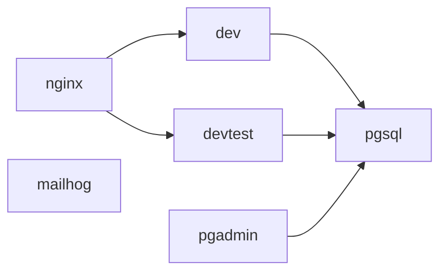
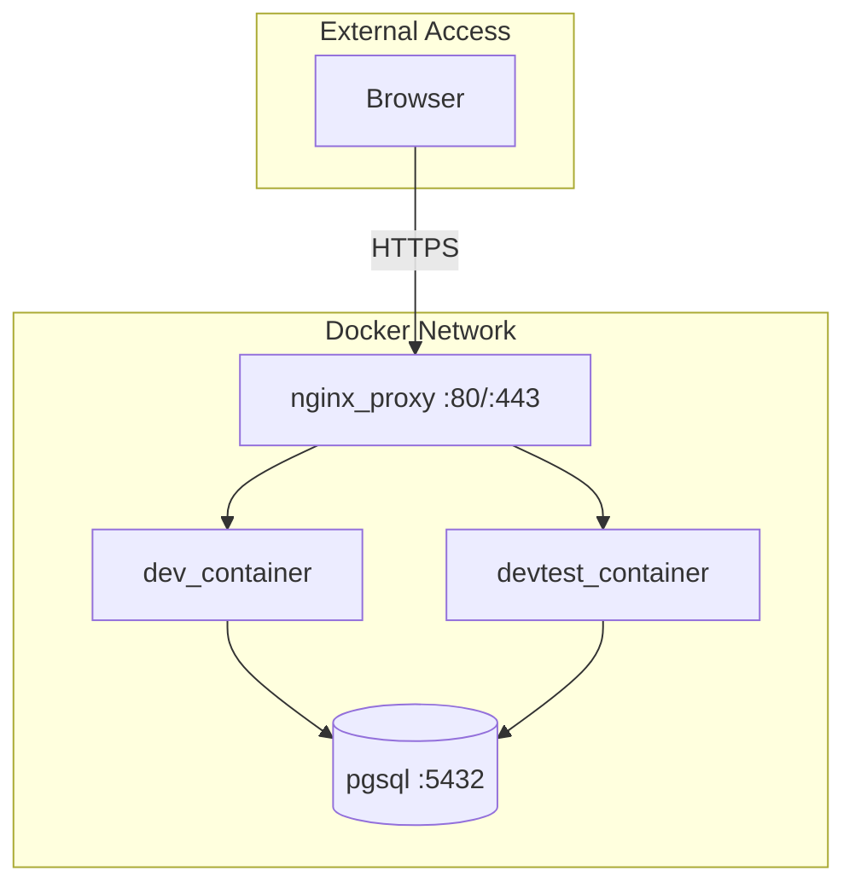

## Overview

SushiGo uses Docker Compose to orchestrate multiple services for development and testing. There are two main compose files:

- **`docker-compose.yml`** - Main development stack
- **`docker-compose.e2e.yml`** - End-to-end testing stack

## Development Stack

The main development stack includes six services:



### Services Overview

| Service | Container | Purpose | Ports |
|---------|-----------|---------|-------|
| **dev** | `dev_container` | Main development environment (API + Webapp) | 5173 |
| **devtest** | `devtest_container` | Isolated testing environment | 8081, 5174 |
| **nginx** | `nginx_proxy` | Reverse proxy with SSL | 80, 443 |
| **pgsql** | `postgres_container` | PostgreSQL 15 database | 5432 |
| **pgadmin** | `pgadmin_container` | Database management UI | 5050 |
| **mailhog** | `mailhog_container` | Email testing server | 8025 |

## Service Details

### dev (Development Container)

Primary development environment running both Laravel API and React webapp.

```yaml
service: dev
image: sushigo/dev:local
working_dir: /app/code
ports:
  - "5173:5173"  # Vite dev server
expose:
  - "80"         # Apache (API)
  - "443"        # Apache SSL
```

**Key Environment Variables:**

| Variable | Default | Description |
|----------|---------|-------------|
| `VITE_PORT` | `5173` | Vite dev server port |
| `VITE_HMR_HOST` | `sushigo.local` | Hot Module Replacement host |
| `VITE_API_URL` | `https://api.sushigo.local/api/v1` | API endpoint for webapp |
| `DB_HOST` | `pgsql` | Database host |
| `POSTGRES_DB` | `mydb` | Database name |

**Health Check:**

```bash
curl -f http://localhost:80/api/v1/health
```

**Volumes:**

- Host `/` → Container `/app` (entire project)
- Docker socket mounted for Docker-in-Docker operations
- Apache config mounted for custom SSL/proxy settings

### devtest (Testing Container)

Isolated environment for running tests without affecting the main dev database.

```yaml
service: devtest
image: sushigo/dev:local
ports:
  - "8081:80"     # API
  - "5174:5173"   # Vite
environment:
  - POSTGRES_DB=mydb_devtest
```

**Use Cases:**
- Running integration tests in isolation
- Testing migrations before applying to dev
- Parallel development workflows

### nginx (Reverse Proxy)

Handles SSL termination and routing for all web services.

```yaml
service: nginx
image: nginx:alpine
ports:
  - "80:80"
  - "443:443"
```

**Routing Configuration:**

| Domain | Backend | Purpose |
|--------|---------|---------|
| `sushigo.local` | `dev:5173` | Webapp (Vite) |
| `api.sushigo.local` | `dev:80` | API (Apache) |
| `devtest.sushigo.local` | `devtest:5173` | Webapp (test) |
| `devtest.api.sushigo.local` | `devtest:80` | API (test) |

**SSL Certificates:**

Self-signed certificates located in:
```
docker/app/config/dev/cert/
├── rootCA.pem            # Root CA certificate
├── sushigo.local.crt     # Site certificate
└── sushigo.local-key.pem # Private key
```

<Warning>
  Install `rootCA.pem` in your system's trust store to avoid browser warnings.
</Warning>

### pgsql (PostgreSQL)

PostgreSQL 15 database server with automatic initialization.

```yaml
service: pgsql
image: postgres:15
ports:
  - "5432:5432"
environment:
  POSTGRES_USER: admin
  POSTGRES_PASSWORD: admin
  POSTGRES_DB: mydb
```

**Databases:**

| Database | Purpose | Created by |
|----------|---------|------------|
| `mydb` | Main development database | Docker compose |
| `mydb_test` | PHPUnit testing database | Init script |
| `mydb_devtest` | Isolated testing environment | Init script |
| `mydb_e2e` | E2E testing database | E2E compose |

**Initialization Script:**

`docker/pgsql/init-test-db.sh` automatically creates test databases on first run.

**Persistent Storage:**

Data is stored in the `pg_data` Docker volume to persist across container restarts.

### pgadmin (Database UI)

Web-based PostgreSQL administration tool.

```yaml
service: pgadmin
image: dpage/pgadmin4:7.6
ports:
  - "5050:80"
credentials:
  email: admin@admin.com
  password: admin
```

**Pre-configured Server:**

Connection details are automatically loaded from `docker/pgadmin/servers.json`.

### mailhog (Email Testing)

SMTP server for capturing outgoing emails during development.

```yaml
service: mailhog
image: mailhog/mailhog
ports:
  - "8025:8025"  # Web UI
```

**Configuration:**

Laravel `.env` should use:
```env
MAIL_MAILER=smtp
MAIL_HOST=mailhog
MAIL_PORT=1025
```

All emails sent by the API will appear in the Mailhog UI at http://localhost:8025.

## E2E Testing Stack

The E2E stack extends the main stack with Cypress testing services.

### test_e2e (E2E Environment)

```yaml
service: test_e2e
container: e2e_container
environment:
  - POSTGRES_DB=mydb_e2e
  - CYPRESS_baseUrl=https://sushigo.e2e.local
```

Uses a separate database (`mydb_e2e`) to avoid interfering with development data.

### cypress (Headless Runner)

```yaml
service: cypress
image: cypress/included:13.17.0
working_dir: /app/code/webapp
command: ["npm install && npx cypress run"]
```

Runs Cypress tests in headless mode (CI/CD compatible).

### cypress-ui (Interactive Mode)

```yaml
service: cypress-ui
ports:
  - "6080:6080"  # noVNC web interface
  - "5900:5900"  # VNC direct
environment:
  DISPLAY: :99
```

Provides a browser UI via VNC for interactive test development. Access at http://localhost:6080.

## Docker Commands

### Starting Services

<CodeGroup>
```bash Full Stack
# Start all development services
docker compose up --build

# Start in background
docker compose up -d
```

```bash Selective Services
# Start only database and API
docker compose up -d pgsql dev

# Start with fresh build
docker compose up --build dev
```

```bash E2E Stack
# Start E2E environment
make e2e-up

# Or manually:
docker compose -f docker-compose.e2e.yml up -d test_e2e
```
</CodeGroup>

### Stopping Services

```bash
# Stop all services
docker compose down

# Stop and remove volumes (⚠️ deletes database data)
docker compose down -v

# Stop specific service
docker compose stop dev
```

### Viewing Logs

<CodeGroup>
```bash All Services
docker compose logs -f
```

```bash Specific Service
docker compose logs -f dev
docker compose logs -f pgsql
```

```bash E2E Logs
docker compose -f docker-compose.e2e.yml logs -f test_e2e
```
</CodeGroup>

### Restarting Services

```bash
# Restart all
docker compose restart

# Restart specific service
docker compose restart dev
docker compose restart nginx
```

### Executing Commands

```bash
# Enter dev container shell
docker exec -it dev_container bash

# Run artisan command
docker exec -it dev_container bash -c "cd /app/code/api && php artisan migrate"

# Run npm command
docker exec -it dev_container bash -c "cd /app/code/webapp && npm run build"

# Database commands
docker exec -it postgres_container psql -U admin -d mydb
```

## Makefile Shortcuts

The project includes a `Makefile` with convenient shortcuts:

| Command | Description |
|---------|-------------|
| `make help` | Show all available commands |
| `make e2e-up` | Start E2E container |
| `make e2e-down` | Stop E2E container |
| `make e2e-restart` | Restart E2E container |
| `make e2e-logs` | View E2E logs |
| `make cypress-ui` | Open Cypress interactive UI (VNC) |
| `make cypress-run` | Run Cypress tests headless |
| `make db-seed` | Run database seeders |
| `make ssl-info` | Show SSL certificate information |
| `make hosts-setup` | Display hosts file configuration instructions |
| `make chrome-clear-hsts` | Instructions for clearing Chrome HSTS cache |

<Tip>
  Run `make help` to see all available commands with descriptions.
</Tip>

## Network Architecture

All services communicate over a shared Docker bridge network:



**Service Discovery:**

Services reference each other by service name:
- API connects to `pgsql:5432` (not `localhost:5432`)
- Webapp proxies API requests through nginx
- Mailhog is accessible as `mailhog:1025` for SMTP

## Health Checks

All critical services define health checks to ensure proper startup order:

```yaml
# PostgreSQL must be ready before API starts
pgsql:
  healthcheck:
    test: ["CMD-SHELL", "pg_isready -U admin -d mydb"]
    interval: 5s
    retries: 5

# API must respond before nginx starts
dev:
  healthcheck:
    test: ["CMD", "curl", "-f", "http://localhost:80/api/v1/health"]
    interval: 10s
    start_period: 40s
```

Use `depends_on` with `condition: service_healthy` to control startup order.

## Volumes

### Named Volumes

| Volume | Purpose | Data |
|--------|---------|------|
| `pg_data` | PostgreSQL data | Databases, tables, indexes |
| `cypress-cache` | Cypress binaries | Shared across E2E containers |

### Bind Mounts

| Host Path | Container Path | Purpose |
|-----------|---------------|---------|
| `./` | `/app` | Entire project (live reload) |
| `./docker/nginx/nginx.conf` | `/etc/nginx/nginx.conf` | Nginx configuration |
| `./docker/app/config/dev/cert` | `/etc/nginx/certs` | SSL certificates |
| `/var/run/docker.sock` | `/var/run/docker.sock` | Docker-in-Docker access |

<Warning>
  Bind mounts enable live code reload but can cause performance issues on macOS/Windows. Consider using named volumes for `node_modules` if needed.
</Warning>

## Troubleshooting

<AccordionGroup>
  <Accordion title="Services won't start">
    ```bash
    # Check for port conflicts
    docker compose ps
    lsof -i :80
    lsof -i :443
    lsof -i :5432

    # View detailed logs
    docker compose logs dev
    docker compose logs pgsql

    # Rebuild from scratch
    docker compose down -v
    docker compose build --no-cache
    docker compose up
    ```
  </Accordion>

  <Accordion title="Database connection errors">
    ```bash
    # Wait for PostgreSQL to be healthy
    docker compose ps pgsql

    # Check database exists
    docker exec -it postgres_container psql -U admin -l

    # Create test database manually
    docker exec -it postgres_container psql -U admin -d mydb \
      -c "CREATE DATABASE mydb_test;"
    ```
  </Accordion>

  <Accordion title="nginx SSL errors">
    ```bash
    # Verify certificates exist
    ls -la docker/app/config/dev/cert/

    # Rebuild dev container to regenerate certs
    docker compose build dev
    docker compose up -d dev

    # Check nginx configuration
    docker exec -it nginx_proxy nginx -t
    docker compose logs nginx
    ```
  </Accordion>

  <Accordion title="Stale container state">
    ```bash
    # Force recreate containers
    docker compose up -d --force-recreate

    # Remove all containers and volumes
    docker compose down -v
    docker volume prune

    # Clean rebuild
    docker compose build --no-cache
    docker compose up
    ```
  </Accordion>
</AccordionGroup>

## Next Steps

<CardGroup cols={2}>
  <Card title="Environment Setup" icon="gear" href="/development/environment-setup">
    Initial setup and VS Code configuration
  </Card>
  
  <Card title="Testing" icon="flask" href="/development/testing">
    Run tests across all environments
  </Card>
</CardGroup>
