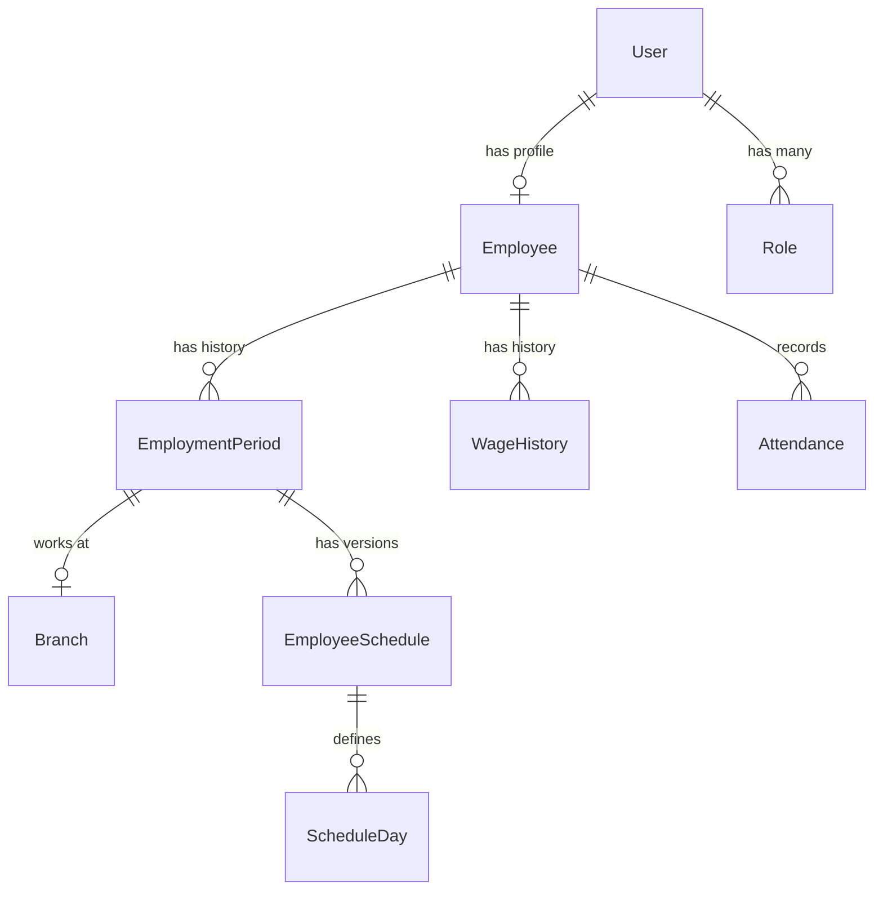

## Introduction

The Employee Management system handles the complete lifecycle of employees in SushiGo, from onboarding through daily operations to termination and rehiring. The system integrates employee profiles, roles and permissions, employment periods, wage history, schedules, and attendance tracking.

## Core Concepts

### Employees vs Users

SushiGo maintains a clear separation between **Employees** (operational profiles) and **Users** (authentication identities):

- **Employee**: Represents a person working at SushiGo with operational data (code, name, employment periods, attendance, wages)
- **User**: Represents authentication credentials and permissions (email, phone, password, roles)

Every employee has a linked user account, but not every user is necessarily an employee.

<Note>
Roles are assigned to the **User** entity, not directly to Employee. The employee profile connects to the user account via `user_id`.
</Note>

### Employment Periods

An employee can have multiple employment periods over time, allowing for:

- **Initial hire**: First employment period created when employee is onboarded
- **Rehire**: New employment period if employee returns after termination
- **Branch transfers**: Employment periods track which branch the employee works at
- **Historical tracking**: Complete employment history preserved

<Info>
Only **one employment period** can be active (`is_active = true`) per employee at any time.
</Info>

### Employee Codes

Every employee has a unique identifier code (e.g., `EMP-001`, `EMP-002`):

- **Prefix**: Configurable via `config/employees.code_prefix` (default: `EMP-`)
- **Padding**: Configurable via `config/employees.code_padding` (default: 3 digits)
- **Auto-suggestion**: System suggests next available code via `/api/v1/employees/next-code`
- **Case handling**: Codes are automatically converted to uppercase
- **Uniqueness**: Validated across all employees (including soft-deleted)

## System Architecture



### Key Relationships

- **Employee** → **User** (1:1): Every employee has one user account
- **Employee** → **EmploymentPeriod** (1:many): Tracks employment history and rehires
- **Employee** → **WageHistory** (1:many): Tracks wage changes over time with effective dates
- **Employee** → **Attendance** (1:many): Daily attendance records
- **EmploymentPeriod** → **Branch** (many:1): Each period is assigned to a branch
- **EmploymentPeriod** → **EmployeeSchedule** (1:many): Schedules versioned with effective dates

## Available Roles

SushiGo defines the following position roles:

| Role | Code | Description |
|------|------|-------------|
| Manager | `manager` | Branch manager with operational oversight |
| Cook | `cook` | Kitchen staff responsible for food preparation |
| Kitchen Assistant | `kitchen-assistant` | Support staff in the kitchen |
| Delivery Driver | `delivery-driver` | Responsible for order deliveries |
| Acting Manager | `acting-manager` | Temporary manager role |
| Admin | `admin` | System administrator with catalog and historical edit permissions |
| Super Admin | `super-admin` | Full system access including user management |

<Warning>
The `super-admin` role is **privileged** and can only be assigned by existing super-admins. Regular admins cannot grant this role.
</Warning>

## Data Model

### Employee

```php
// Fillable fields
'user_id'      // Foreign key to User
'code'         // Unique employee code (e.g., "EMP-001")
'first_name'   // Required, max 100 characters
'last_name'    // Required, max 100 characters
'is_active'    // Boolean, default true
'meta'         // JSON field for additional metadata
```

### EmploymentPeriod

```php
// Fillable fields
'employee_id'         // Foreign key to Employee
'branch_id'           // Foreign key to Branch
'start_date'          // Required date
'end_date'            // Nullable date (null = currently employed)
'termination_reason'  // Optional text
'is_active'           // Boolean - only one active per employee
'meta'                // JSON metadata
```

### WageHistory

```php
// Fillable fields
'employee_id'              // Foreign key to Employee
'hourly_rate'              // Decimal(10,2), must be > 0
'weekly_scheduled_hours'   // Decimal(5,2), must be > 0
'effective_from'           // Required date
'effective_to'             // Nullable date (null = current wage)
```

## Business Rules

### Employee Creation

1. **Required fields**: `code`, `first_name`, `last_name`, `roles`, `branch_id`, `start_date`
2. **Contact method**: At least one of `email` or `phone` must be provided
3. **Phone format**: 10-digit national number (e.g., `5512345678`). Country code (+52 for Mexico) is added automatically
4. **Email validation**: Standard email format, must be unique across all users
5. **User creation**: System automatically creates a linked user account with random password
6. **Welcome notification**: Password setup link sent via email or WhatsApp
7. **Initial employment period**: Created automatically with provided `branch_id` and `start_date`

### Employee Status

- **Active** (`is_active = true`): Employee can work and appears in operational views
- **Inactive** (`is_active = false`): Employee deactivated but record preserved
- **Soft deleted**: Employee record archived but preserved for historical integrity

### Role Assignment Rules

- At least **one role** must be assigned
- Roles are synced to the linked **User** entity
- Non-super-admins **cannot assign** `super-admin` role
- When updating roles, privileged roles outside actor's scope are preserved
- System prevents accidental removal of `super-admin` when edited by non-super-admin

## Search and Filtering

The employee list supports:

- **Search**: By code, first name, or last name (case-insensitive, partial match)
- **Filter by status**: Active/inactive employees
- **Filter by role**: Show only employees with specific role
- **Filter "baja"** (terminated): Employees with no active employment period
- **Sorting**: Multiple fields with direction (e.g., `code:asc`, `last_name:desc`)
- **Pagination**: Configurable per-page limit (default 15)

## Related Modules

- [Creating Employees](/employees/creating-employees) - Step-by-step employee onboarding
- [Roles and Permissions](/employees/roles-and-permissions) - Role assignment and management
- [Wage History](/employees/wage-history) - Wage tracking and updates
- [Attendance Tracking](/employees/attendance-tracking) - Daily attendance operations

## API Reference

<Card title="Employee Endpoints" icon="code" href="/api-reference/employees">
  Complete API documentation for employee management operations
</Card>
