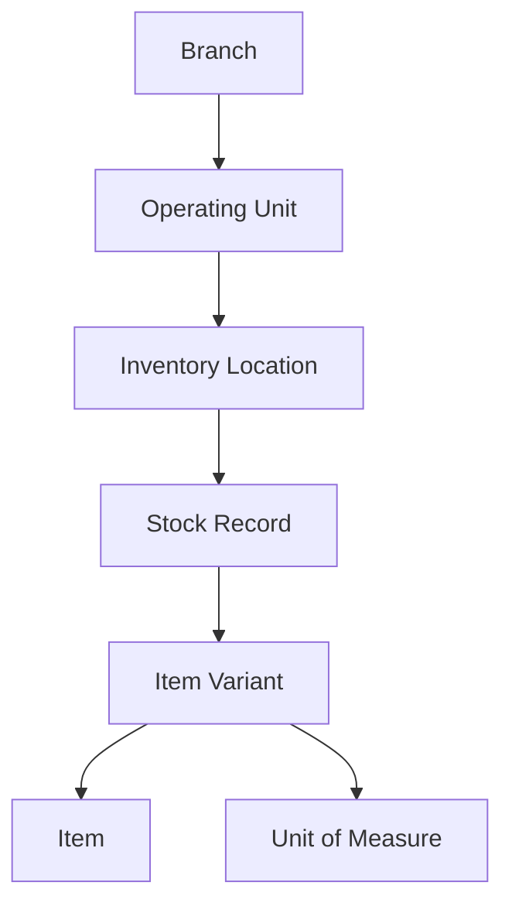

## Introduction

The SushiGo inventory system is designed to manage stock across multiple locations within operating units (branches and events). It provides complete traceability of all movements, supports multiple units of measure with conversions, and maintains weighted average costing for profitability analysis.

<Info>
  The inventory system is built for scalability—from a single branch to multiple locations, and from permanent stores to temporary event inventories.
</Info>

## Architecture Overview

### Core Entities

The inventory system is built around these key entities:

<CardGroup cols={2}>
  <Card title="Items & Variants" icon="box">
    Master catalog of products, supplies, and assets with multiple variants per item
  </Card>
  <Card title="Inventory Locations" icon="warehouse">
    Physical or logical zones within each operating unit (MAIN, KITCHEN, BAR, etc.)
  </Card>
  <Card title="Stock Records" icon="boxes-stacked">
    Current quantities per variant per location with on_hand, reserved, and available
  </Card>
  <Card title="Stock Movements" icon="truck-fast">
    Complete audit trail of all inventory transactions with reason codes
  </Card>
</CardGroup>

### Inventory Hierarchy

<Steps>
  <Step title="Branch Level">
    Physical or administrative branch (e.g., "SushiGo Centro")
  </Step>
  <Step title="Operating Unit Level">
    Operational context within a branch:
    - `BRANCH_MAIN` - Permanent branch inventory
    - `EVENT_TEMP` - Temporary event inventory
  </Step>
  <Step title="Location Level">
    Physical zones within the unit (MAIN, KITCHEN, BAR, RETURN, WASTE)
  </Step>
  <Step title="Stock Level">
    Quantity tracking per variant per location
  </Step>
</Steps>

## Item Types

SushiGo supports three item types, each with specific characteristics:

### INSUMO (Supply/Input)

Raw materials and supplies used in production or service.

<ParamField body="type" type="enum" default="INSUMO">
  - Supports multiple unit conversions (e.g., kg → g, box → unit)
  - Track lot numbers and serial numbers (optional)
  - Perishable flag for expiration tracking
</ParamField>

**Examples**: Rice (kg), Soy Sauce (L), Nori Sheets (pack), Salmon (kg)

### PRODUCTO (Finished Product)

Finished goods ready for sale to customers.

<ParamField body="type" type="enum" default="PRODUCTO">
  - Base unit only (1:1 conversion)
  - Sale price tracking
  - Can be manufactured from INSUMOs
</ParamField>

**Examples**: California Roll (unit), Sushi Combo (set), Ramen Bowl (unit)

### ACTIVO (Asset)

Physical assets used in operations (furniture, equipment, tools).

<ParamField body="type" type="enum" default="ACTIVO">
  - Base unit only (1:1 conversion)
  - Serial number tracking recommended
  - Depreciation tracking (future)
</ParamField>

**Examples**: Rice Cooker (unit), Table (unit), Knife Set (set)

## Stock Tracking

### Stock States

Each variant at each location has three quantity fields:

<ParamField body="on_hand" type="decimal(4)">
  Physical quantity present at the location
</ParamField>

<ParamField body="reserved" type="decimal(4)">
  Quantity reserved for pending orders or transfers
</ParamField>

<ParamField body="available" type="decimal(4)">
  Computed field: `on_hand - reserved` (available for sale/transfer)
</ParamField>

### Cost Tracking

<ParamField body="weighted_avg_cost" type="decimal(4)">
  Weighted average cost per base unit, updated on each receipt
</ParamField>

<ParamField body="last_unit_cost" type="decimal(4)">
  Most recent purchase cost (tracked at variant level)
</ParamField>

<Warning>
  Cost updates only occur on **OPENING_BALANCE** and purchase receipt movements. Sales and transfers use the current weighted average.
</Warning>

## Movement Reasons

All stock changes are recorded as `StockMovement` records with a reason code:

| Reason | Direction | Description |
|--------|-----------|-------------|
| `OPENING_BALANCE` | IN | Initial stock registration |
| `TRANSFER` | BOTH | Inter-location or inter-branch transfer |
| `RETURN` | BOTH | Return from customer or location |
| `SALE` | OUT | Sale to customer (decreases stock) |
| `CONSUMPTION` | OUT | Internal consumption (meals, samples, spoilage) |
| `ADJUSTMENT` | IN/OUT | Manual adjustment (count variance) |
| `COUNT_VARIANCE` | IN/OUT | Adjustment from physical count |

## Design Principles

<CardGroup cols={2}>
  <Card title="Complete Traceability" icon="timeline">
    Every movement records user, timestamp, reason, and optional reference
  </Card>
  <Card title="Multi-UOM Support" icon="ruler">
    Convert between units automatically (kg ↔ g, box ↔ unit)
  </Card>
  <Card title="Location Segregation" icon="layer-group">
    Each location maintains separate stock with transfer tracking
  </Card>
  <Card title="Weighted Costing" icon="dollar-sign">
    Automatic cost updates for profitability analysis
  </Card>
</CardGroup>

## Key Workflows

### 1. Opening Balance Registration

<Steps>
  <Step title="Select Location & Variant">
    Choose inventory location and item variant
  </Step>
  <Step title="Enter Quantity & UOM">
    Enter quantity in any valid unit of measure
  </Step>
  <Step title="Optional: Enter Cost">
    Provide unit cost for cost tracking
  </Step>
  <Step title="Post Movement">
    System converts to base UOM and updates stock + weighted average
  </Step>
</Steps>

### 2. Stock Out (Sale or Consumption)

<Steps>
  <Step title="Select Source Location">
    Choose location to withdraw from (e.g., KITCHEN)
  </Step>
  <Step title="Enter Quantity & Reason">
    Specify quantity and reason (SALE or CONSUMPTION)
  </Step>
  <Step title="Validate Availability">
    System checks available stock >= requested quantity
  </Step>
  <Step title="Post Movement">
    Stock decreases, cost is recorded for profitability tracking
  </Step>
</Steps>

### 3. Inter-Location Transfer

<Steps>
  <Step title="Select Source & Target">
    Choose from_location and to_location
  </Step>
  <Step title="Enter Quantity">
    Specify quantity to transfer (with UOM conversion)
  </Step>
  <Step title="Validate Availability">
    System ensures source has sufficient available stock
  </Step>
  <Step title="Post Movement">
    Stock decreases at source, increases at target atomically
  </Step>
</Steps>

## Data Model Reference

### Item Fields

| Field | Type | Required | Description |
|-------|------|----------|-------------|
| `sku` | string(100) | Yes | Unique SKU code (auto-uppercase) |
| `name` | string(255) | Yes | Item name |
| `description` | text | No | Detailed description |
| `type` | enum | Yes | INSUMO, PRODUCTO, or ACTIVO |
| `is_stocked` | boolean | No | Track in inventory (default: true) |
| `is_perishable` | boolean | No | Has expiration date (default: false) |
| `is_active` | boolean | No | Active status (default: true) |

### ItemVariant Fields

| Field | Type | Required | Description |
|-------|------|----------|-------------|
| `item_id` | integer | Yes | Parent item ID |
| `uom_id` | integer | Yes | Base unit of measure |
| `code` | string(100) | Yes | Unique variant code |
| `barcode` | string(50) | No | Product barcode (EAN/UPC) |
| `name` | string(255) | Yes | Variant name |
| `track_lot` | boolean | No | Track lot numbers (default: false) |
| `track_serial` | boolean | No | Track serial numbers (default: false) |
| `sale_price` | decimal(4) | No | Default sale price |
| `min_stock` | decimal(4) | No | Minimum stock level |
| `max_stock` | decimal(4) | No | Maximum stock level |

### Stock Fields

| Field | Type | Description |
|-------|------|-------------|
| `inventory_location_id` | integer | Location where stock is held |
| `item_variant_id` | integer | Variant being tracked |
| `on_hand` | decimal(4) | Physical quantity on hand |
| `reserved` | decimal(4) | Quantity reserved |
| `available` | decimal(4) | Computed: on_hand - reserved |
| `weighted_avg_cost` | decimal(4) | Current average cost per unit |

### StockMovement Fields

| Field | Type | Description |
|-------|------|-------------|
| `from_location_id` | integer | Source location (null for entries) |
| `to_location_id` | integer | Target location (null for exits) |
| `item_variant_id` | integer | Variant being moved |
| `user_id` | integer | User who created movement |
| `qty` | decimal(4) | Quantity in base UOM |
| `reason` | enum | Movement reason code |
| `status` | enum | DRAFT, POSTED, or REVERSED |
| `reference` | string(100) | External reference number |
| `notes` | text | Additional notes |
| `meta` | jsonb | Original qty/uom, cost, etc. |
| `posted_at` | timestamp | When movement was posted |

## Next Steps

<CardGroup cols={2}>
  <Card title="Items & Variants" icon="box" href="/inventory/items-and-variants">
    Create and manage items and their variants
  </Card>
  <Card title="Inventory Locations" icon="warehouse" href="/inventory/locations">
    Configure locations within operating units
  </Card>
  <Card title="Stock Movements" icon="truck-fast" href="/inventory/stock-movements">
    Record opening balances, transfers, and adjustments
  </Card>
  <Card title="Unit Conversions" icon="ruler" href="/inventory/unit-conversions">
    Set up unit of measure conversions
  </Card>
</CardGroup>
